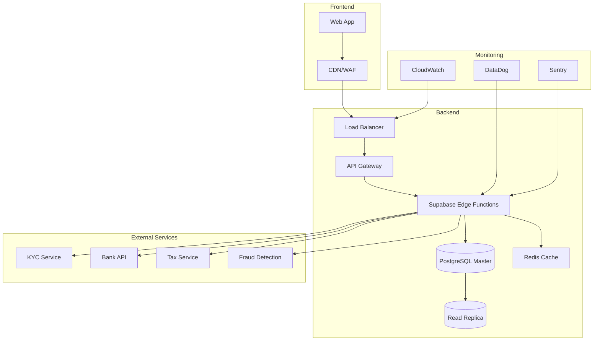

# INTERCONNECT 紹介システム - 本番運用可能な完全実装ガイド

## 目次
1. [システム概要](#システム概要)
2. [法的要件と対応](#法的要件と対応)
3. [セキュリティ実装](#セキュリティ実装)
4. [データベース設計（完全版）](#データベース設計完全版)
5. [KYC実装](#kyc実装)
6. [エラーハンドリングとリカバリ](#エラーハンドリングとリカバリ)
7. [API実装（本番対応）](#api実装本番対応)
8. [フロントエンド実装（完全版）](#フロントエンド実装完全版)
9. [不正検知システム](#不正検知システム)
10. [監視・運用](#監視運用)
11. [テスト戦略](#テスト戦略)
12. [デプロイメント](#デプロイメント)

---

## システム概要

### 基本要件
- 紹介者がtl:dv面談完了で1,000円相当のポイント付与
- 源泉徴収（10.21%）を考慮した税務処理
- KYC（本人確認）必須
- 24時間365日の不正監視
- 完全な監査証跡

### システム構成


---

## 法的要件と対応

### 1. 必要な法的確認

```typescript
// 法的要件チェックリスト
interface LegalRequirements {
  // 景品表示法
  premiumsAndRepresentationsAct: {
    maxRewardRate: 0.2, // 取引価格の20%以下
    requiresClearTerms: true,
    prohibitsMisleading: true
  },
  
  // 特定商取引法
  specifiedCommercialTransactionsAct: {
    requiresBusinessInfo: true,
    requiresCoolingOff: boolean,
    requiresTermsDisplay: true
  },
  
  // 資金決済法
  paymentServicesAct: {
    requiresRegistration: boolean, // 金額による
    requiresSegregatedManagement: boolean,
    requiresUserProtection: true
  },
  
  // 個人情報保護法
  personalInformationProtectionAct: {
    requiresConsent: true,
    requiresPurposeSpecification: true,
    requiresSecurityMeasures: true
  },
  
  // 犯罪収益移転防止法
  antiMoneyLaunderingAct: {
    requiresIdentityVerification: true,
    requiresTransactionMonitoring: true,
    requiresSuspiciousActivityReporting: true
  }
}
```

### 2. 利用規約テンプレート

```markdown
# INTERCONNECT 紹介プログラム利用規約

## 第1条（定義）
1. 「紹介プログラム」とは、当社が提供する会員紹介制度を指します。
2. 「紹介者」とは、新規会員を紹介する既存会員を指します。
3. 「被紹介者」とは、紹介により新規登録した会員を指します。
4. 「紹介報酬」とは、紹介成立時に付与されるポイントを指します。

## 第2条（紹介報酬の条件）
1. 紹介報酬は以下の条件をすべて満たした場合に付与されます：
   - 被紹介者が紹介リンク経由で新規登録
   - 被紹介者がtl:dv面談を完了
   - 不正行為が認められないこと
2. 紹介報酬は1,000ポイント（1ポイント=1円相当）とします。

## 第3条（禁止事項）
以下の行為を禁止します：
1. 自己紹介（複数アカウントの作成）
2. 虚偽情報での登録勧誘
3. スパム行為
4. その他当社が不適切と判断する行為

## 第4条（本人確認）
1. 紹介報酬の現金化には本人確認が必要です。
2. マイナンバーの提出が必要となる場合があります。

## 第5条（税務処理）
1. 紹介報酬には源泉徴収（10.21%）が適用されます。
2. 年間の支払額によっては支払調書を発行します。

## 第6条（免責事項）
当社は以下について責任を負いません：
1. システム障害による紹介記録の消失
2. 不正行為による報酬の取り消し
3. 法令改正による制度変更

## 第7条（規約の変更）
当社は必要に応じて本規約を変更できるものとします。

制定日：2024年XX月XX日
株式会社INTERCONNECT
```

---

## セキュリティ実装

### 1. データ暗号化

```sql
-- 暗号化拡張機能の有効化
CREATE EXTENSION IF NOT EXISTS pgcrypto;

-- 暗号化キー管理テーブル
CREATE TABLE IF NOT EXISTS encryption_keys (
    id UUID DEFAULT gen_random_uuid() PRIMARY KEY,
    key_name VARCHAR(100) UNIQUE NOT NULL,
    encrypted_key TEXT NOT NULL,
    algorithm VARCHAR(50) DEFAULT 'AES-256-GCM',
    created_at TIMESTAMP WITH TIME ZONE DEFAULT NOW(),
    rotated_at TIMESTAMP WITH TIME ZONE,
    is_active BOOLEAN DEFAULT true
);

-- 暗号化関数
CREATE OR REPLACE FUNCTION encrypt_sensitive_data(
    p_data TEXT,
    p_key_name VARCHAR DEFAULT 'default'
) RETURNS TEXT AS $$
DECLARE
    v_key BYTEA;
    v_encrypted TEXT;
BEGIN
    -- キーを取得（実際の実装では外部KMSを使用）
    SELECT convert_from(
        decrypt(
            decode(encrypted_key, 'base64'),
            current_setting('app.master_key')::bytea,
            'aes'
        ),
        'utf8'
    )::bytea INTO v_key
    FROM encryption_keys
    WHERE key_name = p_key_name
    AND is_active = true;
    
    -- データを暗号化
    v_encrypted := encode(
        encrypt(
            convert_to(p_data, 'utf8'),
            v_key,
            'aes'
        ),
        'base64'
    );
    
    RETURN v_encrypted;
END;
$$ LANGUAGE plpgsql SECURITY DEFINER;

-- 復号化関数
CREATE OR REPLACE FUNCTION decrypt_sensitive_data(
    p_encrypted_data TEXT,
    p_key_name VARCHAR DEFAULT 'default'
) RETURNS TEXT AS $$
DECLARE
    v_key BYTEA;
    v_decrypted TEXT;
BEGIN
    -- セキュリティチェック
    IF NOT has_decryption_permission(auth.uid()) THEN
        RAISE EXCEPTION 'Unauthorized decryption attempt';
    END IF;
    
    -- キーを取得
    SELECT convert_from(
        decrypt(
            decode(encrypted_key, 'base64'),
            current_setting('app.master_key')::bytea,
            'aes'
        ),
        'utf8'
    )::bytea INTO v_key
    FROM encryption_keys
    WHERE key_name = p_key_name;
    
    -- データを復号化
    v_decrypted := convert_from(
        decrypt(
            decode(p_encrypted_data, 'base64'),
            v_key,
            'aes'
        ),
        'utf8'
    );
    
    -- 監査ログ
    INSERT INTO decryption_audit_log (
        user_id, decrypted_at, data_type, ip_address
    ) VALUES (
        auth.uid(), NOW(), 'bank_details', inet_client_addr()
    );
    
    RETURN v_decrypted;
END;
$$ LANGUAGE plpgsql SECURITY DEFINER;
```

### 2. アクセス制御

```sql
-- 役割ベースアクセス制御（RBAC）
CREATE TABLE IF NOT EXISTS user_roles (
    user_id UUID REFERENCES auth.users(id),
    role_name VARCHAR(50) NOT NULL,
    granted_at TIMESTAMP WITH TIME ZONE DEFAULT NOW(),
    granted_by UUID REFERENCES auth.users(id),
    expires_at TIMESTAMP WITH TIME ZONE,
    PRIMARY KEY (user_id, role_name)
);

CREATE TABLE IF NOT EXISTS role_permissions (
    role_name VARCHAR(50) NOT NULL,
    permission_name VARCHAR(100) NOT NULL,
    resource_type VARCHAR(50),
    allowed_actions TEXT[],
    conditions JSONB,
    PRIMARY KEY (role_name, permission_name)
);

-- デフォルトロールの設定
INSERT INTO role_permissions (role_name, permission_name, resource_type, allowed_actions) VALUES
('user', 'view_own_referrals', 'referrals', ARRAY['read']),
('user', 'create_referral_link', 'referral_links', ARRAY['create']),
('user', 'request_cashout', 'cashouts', ARRAY['create']),
('admin', 'view_all_referrals', 'referrals', ARRAY['read']),
('admin', 'approve_cashouts', 'cashouts', ARRAY['update']),
('admin', 'manage_fraud_alerts', 'fraud_alerts', ARRAY['read', 'update']),
('finance', 'process_payments', 'payments', ARRAY['create', 'update']),
('finance', 'generate_tax_reports', 'reports', ARRAY['read', 'create']);

-- アクセス権限チェック関数
CREATE OR REPLACE FUNCTION check_permission(
    p_user_id UUID,
    p_resource_type VARCHAR,
    p_action VARCHAR
) RETURNS BOOLEAN AS $$
DECLARE
    v_has_permission BOOLEAN := false;
BEGIN
    SELECT EXISTS(
        SELECT 1
        FROM user_roles ur
        JOIN role_permissions rp ON ur.role_name = rp.role_name
        WHERE ur.user_id = p_user_id
        AND (ur.expires_at IS NULL OR ur.expires_at > NOW())
        AND rp.resource_type = p_resource_type
        AND p_action = ANY(rp.allowed_actions)
    ) INTO v_has_permission;
    
    -- 権限チェックの監査ログ
    INSERT INTO permission_audit_log (
        user_id, resource_type, action, granted, checked_at
    ) VALUES (
        p_user_id, p_resource_type, p_action, v_has_permission, NOW()
    );
    
    RETURN v_has_permission;
END;
$$ LANGUAGE plpgsql SECURITY DEFINER;
```

### 3. 入力検証とサニタイゼーション

```typescript
// 入力検証ミドルウェア
import { z } from 'zod';
import DOMPurify from 'isomorphic-dompurify';

// 銀行口座情報のスキーマ
const BankDetailsSchema = z.object({
  bank_name: z.string()
    .min(1, '銀行名は必須です')
    .max(50, '銀行名は50文字以内で入力してください')
    .regex(/^[ァ-ヶー一-龠a-zA-Z0-9\s]+$/, '使用できない文字が含まれています'),
  
  branch_name: z.string()
    .min(1, '支店名は必須です')
    .max(50, '支店名は50文字以内で入力してください')
    .regex(/^[ァ-ヶー一-龠a-zA-Z0-9\s]+$/, '使用できない文字が含まれています'),
  
  account_type: z.enum(['普通', '当座'], {
    errorMap: () => ({ message: '口座種別は普通または当座を選択してください' })
  }),
  
  account_number: z.string()
    .regex(/^\d{7}$/, '口座番号は7桁の数字で入力してください'),
  
  account_holder: z.string()
    .min(1, '口座名義は必須です')
    .max(100, '口座名義は100文字以内で入力してください')
    .regex(/^[ァ-ヶー\s]+$/, '口座名義はカタカナで入力してください')
});

// XSS対策
export function sanitizeInput(input: any): any {
  if (typeof input === 'string') {
    return DOMPurify.sanitize(input, {
      ALLOWED_TAGS: [],
      ALLOWED_ATTR: []
    });
  }
  
  if (typeof input === 'object' && input !== null) {
    const sanitized: any = Array.isArray(input) ? [] : {};
    for (const key in input) {
      sanitized[key] = sanitizeInput(input[key]);
    }
    return sanitized;
  }
  
  return input;
}

// SQLインジェクション対策（パラメータ化クエリの使用を強制）
export class SecureDatabase {
  private supabase: SupabaseClient;
  
  async executeQuery<T>(
    query: string,
    params: any[],
    options?: { timeout?: number }
  ): Promise<T> {
    // パラメータの検証
    params.forEach((param, index) => {
      if (typeof param === 'string' && param.includes('--')) {
        throw new Error(`Suspicious parameter at index ${index}`);
      }
    });
    
    try {
      const result = await this.supabase.rpc('execute_parameterized_query', {
        query_template: query,
        parameters: params,
        timeout_ms: options?.timeout || 30000
      });
      
      return result.data;
    } catch (error) {
      // エラーログ（ユーザーには詳細を見せない）
      console.error('Database query error:', error);
      throw new Error('データベースエラーが発生しました');
    }
  }
}
```

---

## データベース設計（完全版）

### 1. コアテーブル拡張

```sql
-- ========================================
-- KYC情報テーブル
-- ========================================
CREATE TABLE IF NOT EXISTS kyc_verifications (
    id UUID DEFAULT gen_random_uuid() PRIMARY KEY,
    user_id UUID REFERENCES auth.users(id) ON DELETE CASCADE,
    
    -- 本人確認情報
    verification_type VARCHAR(50) NOT NULL, -- 'ekyc', 'manual', 'bank_account'
    verification_status VARCHAR(20) DEFAULT 'pending',
    verification_level INTEGER DEFAULT 1, -- 1: 基本, 2: 詳細, 3: 完全
    
    -- 個人情報（暗号化）
    full_name_encrypted TEXT NOT NULL,
    full_name_kana_encrypted TEXT,
    birth_date_encrypted TEXT,
    address_encrypted TEXT,
    phone_encrypted TEXT,
    
    -- 本人確認書類
    id_document_type VARCHAR(50), -- 'drivers_license', 'mynumber_card', 'passport'
    id_document_number_encrypted TEXT,
    id_document_front_url TEXT,
    id_document_back_url TEXT,
    id_document_expiry DATE,
    
    -- マイナンバー情報
    mynumber_encrypted TEXT,
    mynumber_collected_at TIMESTAMP WITH TIME ZONE,
    mynumber_collection_reason TEXT,
    
    -- 検証結果
    verified_at TIMESTAMP WITH TIME ZONE,
    verified_by VARCHAR(100), -- システムまたは担当者ID
    verification_method VARCHAR(50),
    verification_score DECIMAL(3, 2),
    
    -- リスク評価
    risk_score DECIMAL(3, 2) DEFAULT 0.00,
    risk_factors JSONB DEFAULT '[]',
    pep_check_result JSONB, -- 政治的影響力のある人物チェック
    sanctions_check_result JSONB, -- 制裁リストチェック
    
    -- メタデータ
    ip_address INET,
    user_agent TEXT,
    device_id TEXT,
    created_at TIMESTAMP WITH TIME ZONE DEFAULT NOW(),
    updated_at TIMESTAMP WITH TIME ZONE DEFAULT NOW(),
    
    CONSTRAINT unique_user_kyc UNIQUE(user_id)
);

-- インデックス
CREATE INDEX idx_kyc_verification_status ON kyc_verifications(verification_status);
CREATE INDEX idx_kyc_risk_score ON kyc_verifications(risk_score) WHERE risk_score > 0.5;

-- ========================================
-- 税務情報テーブル
-- ========================================
CREATE TABLE IF NOT EXISTS tax_information (
    id UUID DEFAULT gen_random_uuid() PRIMARY KEY,
    user_id UUID REFERENCES auth.users(id) ON DELETE CASCADE,
    
    -- 基本情報
    tax_year INTEGER NOT NULL,
    residency_status VARCHAR(20), -- 'resident', 'non_resident'
    country_code VARCHAR(2) DEFAULT 'JP',
    
    -- 源泉徴収情報
    total_earnings DECIMAL(10, 2) DEFAULT 0,
    total_tax_withheld DECIMAL(10, 2) DEFAULT 0,
    withholding_rate DECIMAL(5, 4) DEFAULT 0.1021,
    
    -- 支払調書情報
    payment_record_required BOOLEAN DEFAULT false,
    payment_record_issued BOOLEAN DEFAULT false,
    payment_record_issued_at TIMESTAMP WITH TIME ZONE,
    
    -- マイナンバー提出状況
    mynumber_submitted BOOLEAN DEFAULT false,
    mynumber_exemption_reason TEXT,
    
    -- 追加情報
    tax_treaty_applicable BOOLEAN DEFAULT false,
    tax_treaty_country VARCHAR(2),
    reduced_rate DECIMAL(5, 4),
    
    created_at TIMESTAMP WITH TIME ZONE DEFAULT NOW(),
    updated_at TIMESTAMP WITH TIME ZONE DEFAULT NOW(),
    
    CONSTRAINT unique_user_tax_year UNIQUE(user_id, tax_year)
);

-- ========================================
-- 決済処理テーブル
-- ========================================
CREATE TABLE IF NOT EXISTS payment_transactions (
    id UUID DEFAULT gen_random_uuid() PRIMARY KEY,
    cashout_request_id UUID REFERENCES cashout_requests(id),
    
    -- トランザクション情報
    transaction_id VARCHAR(100) UNIQUE NOT NULL,
    payment_method VARCHAR(50) DEFAULT 'bank_transfer',
    
    -- 金額情報
    gross_amount DECIMAL(10, 2) NOT NULL,
    fee_amount DECIMAL(10, 2) DEFAULT 0,
    tax_amount DECIMAL(10, 2) NOT NULL,
    net_amount DECIMAL(10, 2) NOT NULL,
    
    -- 処理状態
    status VARCHAR(20) DEFAULT 'pending',
    status_history JSONB DEFAULT '[]',
    
    -- 銀行処理情報
    bank_reference_number VARCHAR(100),
    bank_processing_date DATE,
    bank_response_code VARCHAR(10),
    bank_response_message TEXT,
    
    -- エラー情報
    error_code VARCHAR(50),
    error_message TEXT,
    retry_count INTEGER DEFAULT 0,
    max_retries INTEGER DEFAULT 3,
    
    -- タイムスタンプ
    initiated_at TIMESTAMP WITH TIME ZONE DEFAULT NOW(),
    processed_at TIMESTAMP WITH TIME ZONE,
    completed_at TIMESTAMP WITH TIME ZONE,
    failed_at TIMESTAMP WITH TIME ZONE,
    
    -- 監査情報
    initiated_by UUID REFERENCES auth.users(id),
    approved_by UUID REFERENCES auth.users(id),
    approval_notes TEXT
);

-- ========================================
-- 不正検知詳細テーブル
-- ========================================
CREATE TABLE IF NOT EXISTS fraud_investigation_cases (
    id UUID DEFAULT gen_random_uuid() PRIMARY KEY,
    case_number VARCHAR(20) UNIQUE NOT NULL,
    
    -- ケース情報
    case_type VARCHAR(50) NOT NULL, -- 'suspicious_referral', 'multiple_accounts', etc
    severity VARCHAR(20) NOT NULL, -- 'low', 'medium', 'high', 'critical'
    status VARCHAR(20) DEFAULT 'open', -- 'open', 'investigating', 'resolved', 'escalated'
    
    -- 関連ユーザー
    primary_user_id UUID REFERENCES auth.users(id),
    related_user_ids UUID[],
    
    -- 調査詳細
    detection_method VARCHAR(50),
    detection_rules TEXT[],
    evidence JSONB DEFAULT '[]',
    
    -- アクション
    actions_taken JSONB DEFAULT '[]',
    blocked_users UUID[],
    reversed_transactions UUID[],
    
    -- 担当者
    assigned_to UUID REFERENCES auth.users(id),
    assigned_at TIMESTAMP WITH TIME ZONE,
    
    -- 解決情報
    resolution VARCHAR(50), -- 'false_positive', 'confirmed_fraud', 'insufficient_evidence'
    resolution_notes TEXT,
    resolved_by UUID REFERENCES auth.users(id),
    resolved_at TIMESTAMP WITH TIME ZONE,
    
    -- メタデータ
    created_at TIMESTAMP WITH TIME ZONE DEFAULT NOW(),
    updated_at TIMESTAMP WITH TIME ZONE DEFAULT NOW()
);

-- ========================================
-- 監査ログ詳細テーブル
-- ========================================
CREATE TABLE IF NOT EXISTS detailed_audit_logs (
    id UUID DEFAULT gen_random_uuid() PRIMARY KEY,
    
    -- 基本情報
    event_type VARCHAR(100) NOT NULL,
    event_category VARCHAR(50) NOT NULL,
    severity VARCHAR(20) DEFAULT 'info',
    
    -- アクター情報
    actor_id UUID,
    actor_type VARCHAR(50), -- 'user', 'system', 'admin'
    actor_ip INET,
    actor_user_agent TEXT,
    actor_device_id TEXT,
    
    -- ターゲット情報
    target_type VARCHAR(50),
    target_id UUID,
    target_table VARCHAR(100),
    
    -- 変更内容
    action VARCHAR(50) NOT NULL,
    old_values JSONB,
    new_values JSONB,
    change_summary TEXT,
    
    -- コンテキスト
    request_id UUID,
    session_id TEXT,
    api_endpoint TEXT,
    http_method VARCHAR(10),
    
    -- 結果
    success BOOLEAN DEFAULT true,
    error_code VARCHAR(50),
    error_message TEXT,
    
    -- パフォーマンス
    duration_ms INTEGER,
    database_queries INTEGER,
    
    -- タイムスタンプ
    created_at TIMESTAMP WITH TIME ZONE DEFAULT NOW()
);

-- パーティショニング（月単位）
CREATE TABLE detailed_audit_logs_2024_01 PARTITION OF detailed_audit_logs
FOR VALUES FROM ('2024-01-01') TO ('2024-02-01');

-- インデックス
CREATE INDEX idx_audit_logs_event_type ON detailed_audit_logs(event_type, created_at DESC);
CREATE INDEX idx_audit_logs_actor ON detailed_audit_logs(actor_id, created_at DESC);
CREATE INDEX idx_audit_logs_target ON detailed_audit_logs(target_type, target_id, created_at DESC);
```

### 2. ビューとマテリアライズドビュー

```sql
-- ========================================
-- リアルタイムダッシュボード用ビュー
-- ========================================
CREATE MATERIALIZED VIEW referral_dashboard_stats AS
WITH hourly_stats AS (
    SELECT 
        date_trunc('hour', created_at) AS hour,
        COUNT(*) AS invitations_sent,
        COUNT(DISTINCT inviter_id) AS active_inviters,
        COUNT(*) FILTER (WHERE status = 'accepted') AS registrations,
        COUNT(*) FILTER (WHERE reward_status = 'earned') AS completions
    FROM invitations
    WHERE created_at > NOW() - INTERVAL '7 days'
    GROUP BY hour
),
user_stats AS (
    SELECT 
        inviter_id,
        COUNT(*) AS total_invitations,
        COUNT(*) FILTER (WHERE reward_status = 'earned') AS successful_referrals,
        SUM(reward_points) FILTER (WHERE reward_status = 'earned') AS total_points_earned
    FROM invitations
    GROUP BY inviter_id
)
SELECT 
    h.*,
    (SELECT COUNT(DISTINCT inviter_id) FROM user_stats WHERE successful_referrals > 0) AS successful_inviters,
    (SELECT AVG(successful_referrals::float / NULLIF(total_invitations, 0)) FROM user_stats) AS avg_conversion_rate,
    (SELECT percentile_cont(0.5) WITHIN GROUP (ORDER BY total_points_earned) FROM user_stats) AS median_earnings
FROM hourly_stats h;

-- 1時間ごとに更新
CREATE INDEX idx_dashboard_stats_hour ON referral_dashboard_stats(hour DESC);

-- ========================================
-- 不正検知用集計ビュー
-- ========================================
CREATE MATERIALIZED VIEW fraud_risk_indicators AS
WITH device_clusters AS (
    SELECT 
        device_id,
        array_agg(DISTINCT user_id) AS users,
        COUNT(DISTINCT user_id) AS user_count,
        COUNT(DISTINCT ip_address) AS ip_count,
        MIN(created_at) AS first_seen,
        MAX(created_at) AS last_seen
    FROM user_activities
    WHERE device_id IS NOT NULL
    GROUP BY device_id
    HAVING COUNT(DISTINCT user_id) > 1
),
rapid_referrals AS (
    SELECT 
        inviter_id,
        date_trunc('hour', created_at) AS hour,
        COUNT(*) AS invitations_count,
        array_agg(id) AS invitation_ids
    FROM invitations
    WHERE created_at > NOW() - INTERVAL '24 hours'
    GROUP BY inviter_id, hour
    HAVING COUNT(*) > 5
),
suspicious_patterns AS (
    SELECT 
        i1.inviter_id AS user_id,
        'circular_referral' AS pattern_type,
        jsonb_build_object(
            'referred_by', i2.inviter_id,
            'referred_back', i1.invitee_email
        ) AS details
    FROM invitations i1
    JOIN invitations i2 ON i1.inviter_id::text = i2.invitee_email
    WHERE i1.created_at > i2.created_at
)
SELECT * FROM (
    SELECT 'device_sharing' AS risk_type, device_id AS identifier, 
           user_count AS risk_score, users::text AS details
    FROM device_clusters
    
    UNION ALL
    
    SELECT 'rapid_invitations' AS risk_type, inviter_id::text AS identifier,
           invitations_count AS risk_score, invitation_ids::text AS details
    FROM rapid_referrals
    
    UNION ALL
    
    SELECT pattern_type AS risk_type, user_id::text AS identifier,
           1.0 AS risk_score, details::text
    FROM suspicious_patterns
) AS all_risks;

-- インデックス
CREATE INDEX idx_fraud_risk_type ON fraud_risk_indicators(risk_type, risk_score DESC);
```

---

## KYC実装

### 1. KYCフロー

```typescript
// supabase/functions/kyc-verification/index.ts
import { serve } from "https://deno.land/std@0.168.0/http/server.ts"
import { createClient } from 'https://esm.sh/@supabase/supabase-js@2'

interface KYCRequest {
  step: 'initiate' | 'upload_document' | 'verify_selfie' | 'complete'
  data: any
}

interface KYCProvider {
  verify(data: any): Promise<KYCResult>
}

class KYCService {
  private providers: Map<string, KYCProvider> = new Map()
  
  constructor(private supabase: SupabaseClient) {
    // プロバイダーの初期化
    this.providers.set('jumio', new JumioProvider())
    this.providers.set('onfido', new OnfidoProvider())
    this.providers.set('manual', new ManualVerificationProvider())
  }
  
  async processKYC(userId: string, request: KYCRequest): Promise<any> {
    const startTime = Date.now()
    
    try {
      // 既存のKYC情報を確認
      const { data: existingKYC } = await this.supabase
        .from('kyc_verifications')
        .select('*')
        .eq('user_id', userId)
        .single()
      
      // ステップに応じた処理
      switch (request.step) {
        case 'initiate':
          return await this.initiateKYC(userId, existingKYC)
          
        case 'upload_document':
          return await this.uploadDocument(userId, request.data)
          
        case 'verify_selfie':
          return await this.verifySelfie(userId, request.data)
          
        case 'complete':
          return await this.completeKYC(userId)
          
        default:
          throw new Error('Invalid KYC step')
      }
    } catch (error) {
      // エラーログ
      await this.logKYCEvent(userId, 'error', {
        step: request.step,
        error: error.message,
        duration_ms: Date.now() - startTime
      })
      
      throw error
    }
  }
  
  private async initiateKYC(userId: string, existingKYC: any) {
    if (existingKYC?.verification_status === 'completed') {
      return {
        status: 'already_verified',
        level: existingKYC.verification_level
      }
    }
    
    // KYCセッションを作成
    const sessionId = crypto.randomUUID()
    
    const { error } = await this.supabase
      .from('kyc_verifications')
      .upsert({
        user_id: userId,
        verification_status: 'in_progress',
        verification_type: 'ekyc',
        ip_address: this.getClientIP(),
        user_agent: this.getUserAgent(),
        device_id: await this.getDeviceFingerprint()
      })
    
    if (error) throw error
    
    // 必要な情報を返す
    return {
      session_id: sessionId,
      required_documents: ['government_id', 'selfie'],
      upload_url: await this.generateSecureUploadURL(userId, sessionId)
    }
  }
  
  private async uploadDocument(userId: string, data: any) {
    const { document_type, file_data, metadata } = data
    
    // ファイル検証
    await this.validateDocument(file_data, document_type)
    
    // ウイルススキャン
    const scanResult = await this.scanFile(file_data)
    if (!scanResult.clean) {
      throw new Error('File failed security scan')
    }
    
    // 画像処理（個人情報のマスキング等）
    const processedImage = await this.processDocumentImage(file_data)
    
    // セキュアストレージに保存
    const storageUrl = await this.storeSecurely(processedImage, {
      user_id: userId,
      document_type,
      encryption: true
    })
    
    // OCR処理
    const ocrResult = await this.performOCR(processedImage, document_type)
    
    // データベース更新
    const updateData: any = {
      id_document_type: document_type,
      [`id_document_${metadata.side}_url`]: storageUrl,
      updated_at: new Date().toISOString()
    }
    
    // OCR結果を暗号化して保存
    if (ocrResult.success) {
      updateData.full_name_encrypted = await this.encrypt(ocrResult.data.full_name)
      updateData.birth_date_encrypted = await this.encrypt(ocrResult.data.birth_date)
      updateData.id_document_number_encrypted = await this.encrypt(ocrResult.data.document_number)
    }
    
    await this.supabase
      .from('kyc_verifications')
      .update(updateData)
      .eq('user_id', userId)
    
    return {
      status: 'document_uploaded',
      ocr_success: ocrResult.success,
      next_step: metadata.side === 'front' ? 'upload_back' : 'verify_selfie'
    }
  }
  
  private async verifySelfie(userId: string, data: any) {
    const { selfie_data } = data
    
    // 生体認証チェック
    const livenessResult = await this.checkLiveness(selfie_data)
    if (!livenessResult.is_live) {
      throw new Error('Liveness check failed')
    }
    
    // 顔照合
    const { data: kyc } = await this.supabase
      .from('kyc_verifications')
      .select('id_document_front_url')
      .eq('user_id', userId)
      .single()
    
    const matchResult = await this.matchFaces(
      kyc.id_document_front_url,
      selfie_data
    )
    
    if (matchResult.confidence < 0.95) {
      return {
        status: 'verification_failed',
        reason: 'face_mismatch',
        can_retry: true
      }
    }
    
    // 成功
    await this.supabase
      .from('kyc_verifications')
      .update({
        verification_score: matchResult.confidence,
        verified_at: new Date().toISOString()
      })
      .eq('user_id', userId)
    
    return {
      status: 'selfie_verified',
      next_step: 'complete'
    }
  }
  
  private async completeKYC(userId: string) {
    // 最終チェック
    const { data: kyc } = await this.supabase
      .from('kyc_verifications')
      .select('*')
      .eq('user_id', userId)
      .single()
    
    // リスクスコア計算
    const riskScore = await this.calculateRiskScore(kyc)
    
    // 制裁リストチェック
    const sanctionsCheck = await this.checkSanctionsList({
      name: await this.decrypt(kyc.full_name_encrypted),
      birth_date: await this.decrypt(kyc.birth_date_encrypted)
    })
    
    // PEPチェック
    const pepCheck = await this.checkPEP({
      name: await this.decrypt(kyc.full_name_encrypted)
    })
    
    // 最終判定
    const verificationLevel = this.determineVerificationLevel({
      risk_score: riskScore,
      sanctions_check: sanctionsCheck,
      pep_check: pepCheck
    })
    
    // 更新
    await this.supabase
      .from('kyc_verifications')
      .update({
        verification_status: 'completed',
        verification_level: verificationLevel,
        risk_score: riskScore,
        sanctions_check_result: sanctionsCheck,
        pep_check_result: pepCheck,
        verified_by: 'system',
        verification_method: 'automated'
      })
      .eq('user_id', userId)
    
    // 通知
    await this.notifyKYCComplete(userId, verificationLevel)
    
    return {
      status: 'completed',
      verification_level: verificationLevel,
      can_withdraw: verificationLevel >= 2
    }
  }
  
  // ユーティリティメソッド
  private async encrypt(data: string): Promise<string> {
    // 実装は前述のencrypt_sensitive_data関数を使用
    return await this.supabase.rpc('encrypt_sensitive_data', { p_data: data })
  }
  
  private async decrypt(encryptedData: string): Promise<string> {
    // 実装は前述のdecrypt_sensitive_data関数を使用
    return await this.supabase.rpc('decrypt_sensitive_data', { p_encrypted_data: encryptedData })
  }
  
  private async logKYCEvent(userId: string, eventType: string, details: any) {
    await this.supabase
      .from('detailed_audit_logs')
      .insert({
        event_type: `kyc_${eventType}`,
        event_category: 'kyc',
        actor_id: userId,
        actor_type: 'user',
        target_type: 'kyc_verification',
        target_id: userId,
        action: eventType,
        new_values: details
      })
  }
}

// メイン関数
serve(async (req) => {
  const corsHeaders = {
    'Access-Control-Allow-Origin': '*',
    'Access-Control-Allow-Headers': 'authorization, x-client-info, apikey, content-type',
  }
  
  if (req.method === 'OPTIONS') {
    return new Response('ok', { headers: corsHeaders })
  }
  
  try {
    const supabaseClient = createClient(
      Deno.env.get('SUPABASE_URL') ?? '',
      Deno.env.get('SUPABASE_ANON_KEY') ?? '',
      { global: { headers: { Authorization: req.headers.get('Authorization')! } } }
    )
    
    const { data: { user }, error: authError } = await supabaseClient.auth.getUser()
    if (authError || !user) {
      return new Response(JSON.stringify({ error: 'Unauthorized' }), {
        status: 401,
        headers: { ...corsHeaders, 'Content-Type': 'application/json' }
      })
    }
    
    const kycService = new KYCService(supabaseClient)
    const request: KYCRequest = await req.json()
    
    const result = await kycService.processKYC(user.id, request)
    
    return new Response(JSON.stringify({
      success: true,
      data: result
    }), {
      headers: { ...corsHeaders, 'Content-Type': 'application/json' }
    })
    
  } catch (error) {
    return new Response(JSON.stringify({
      success: false,
      error: error.message
    }), {
      status: 400,
      headers: { ...corsHeaders, 'Content-Type': 'application/json' }
    })
  }
})
```

### 2. マイナンバー収集

```typescript
// マイナンバー収集の実装
class MynumberCollection {
  async collectMynumber(userId: string, encryptedMynumber: string, purpose: string) {
    // 二重暗号化
    const doubleEncrypted = await this.doubleEncrypt(encryptedMynumber)
    
    // 保存
    const { error } = await supabase
      .from('kyc_verifications')
      .update({
        mynumber_encrypted: doubleEncrypted,
        mynumber_collected_at: new Date().toISOString(),
        mynumber_collection_reason: purpose
      })
      .eq('user_id', userId)
    
    if (error) throw error
    
    // 税務情報も更新
    await supabase
      .from('tax_information')
      .upsert({
        user_id: userId,
        tax_year: new Date().getFullYear(),
        mynumber_submitted: true
      })
    
    // 監査ログ
    await this.logMynumberCollection(userId, purpose)
    
    return { success: true }
  }
  
  private async doubleEncrypt(data: string): Promise<string> {
    // 第一層：クライアント側で暗号化済み
    // 第二層：サーバー側で追加暗号化
    const serverKey = await this.getServerEncryptionKey()
    return await this.encryptWithKey(data, serverKey)
  }
}
```

---

## エラーハンドリングとリカバリ

### 1. 包括的エラーハンドリング

```typescript
// error-handler.ts
export class ErrorHandler {
  private static errorMap = new Map([
    // ビジネスエラー
    ['INSUFFICIENT_POINTS', { code: 'BIZ001', message: 'ポイントが不足しています', httpStatus: 400 }],
    ['KYC_NOT_COMPLETED', { code: 'BIZ002', message: '本人確認が完了していません', httpStatus: 403 }],
    ['DUPLICATE_REFERRAL', { code: 'BIZ003', message: 'すでに紹介済みのユーザーです', httpStatus: 409 }],
    
    // システムエラー
    ['DATABASE_ERROR', { code: 'SYS001', message: 'システムエラーが発生しました', httpStatus: 500 }],
    ['EXTERNAL_API_ERROR', { code: 'SYS002', message: '外部サービスとの通信に失敗しました', httpStatus: 502 }],
    ['TIMEOUT_ERROR', { code: 'SYS003', message: '処理がタイムアウトしました', httpStatus: 504 }],
    
    // セキュリティエラー
    ['UNAUTHORIZED', { code: 'SEC001', message: '認証が必要です', httpStatus: 401 }],
    ['FORBIDDEN', { code: 'SEC002', message: 'アクセス権限がありません', httpStatus: 403 }],
    ['RATE_LIMIT_EXCEEDED', { code: 'SEC003', message: 'リクエスト数が上限を超えました', httpStatus: 429 }]
  ])
  
  static async handle(error: any, context: any): Promise<Response> {
    // エラーID生成
    const errorId = crypto.randomUUID()
    const timestamp = new Date().toISOString()
    
    // エラー分類
    const errorType = this.classifyError(error)
    const errorInfo = this.errorMap.get(errorType) || {
      code: 'UNKNOWN',
      message: 'エラーが発生しました',
      httpStatus: 500
    }
    
    // 詳細ログ（本番環境では外部ログサービスへ）
    await this.logError({
      error_id: errorId,
      error_type: errorType,
      error_code: errorInfo.code,
      error_message: error.message,
      stack_trace: error.stack,
      context,
      timestamp
    })
    
    // ユーザー向けレスポンス
    const response = {
      error: {
        id: errorId,
        code: errorInfo.code,
        message: errorInfo.message,
        timestamp
      }
    }
    
    // 開発環境では詳細情報を含める
    if (Deno.env.get('ENVIRONMENT') === 'development') {
      response.error['details'] = error.message
      response.error['stack'] = error.stack
    }
    
    return new Response(JSON.stringify(response), {
      status: errorInfo.httpStatus,
      headers: {
        'Content-Type': 'application/json',
        'X-Error-Id': errorId
      }
    })
  }
  
  private static classifyError(error: any): string {
    // PostgreSQLエラーコード
    if (error.code === '23505') return 'DUPLICATE_REFERRAL'
    if (error.code === '23503') return 'FOREIGN_KEY_VIOLATION'
    
    // カスタムエラー
    if (error.type) return error.type
    
    // メッセージベース
    if (error.message?.includes('timeout')) return 'TIMEOUT_ERROR'
    if (error.message?.includes('unauthorized')) return 'UNAUTHORIZED'
    
    return 'UNKNOWN_ERROR'
  }
  
  private static async logError(errorData: any) {
    try {
      // Sentry/DataDog/CloudWatch等への送信
      await sendToLoggingService(errorData)
      
      // データベースにも記録
      await supabase
        .from('error_logs')
        .insert(errorData)
    } catch (logError) {
      // ログ失敗時はコンソールに出力
      console.error('Failed to log error:', logError)
      console.error('Original error:', errorData)
    }
  }
}

// リトライ機構
export class RetryHandler {
  static async executeWithRetry<T>(
    operation: () => Promise<T>,
    options: {
      maxRetries?: number
      initialDelay?: number
      maxDelay?: number
      backoffFactor?: number
      retryableErrors?: string[]
    } = {}
  ): Promise<T> {
    const {
      maxRetries = 3,
      initialDelay = 1000,
      maxDelay = 30000,
      backoffFactor = 2,
      retryableErrors = ['TIMEOUT_ERROR', 'EXTERNAL_API_ERROR']
    } = options
    
    let lastError: any
    let delay = initialDelay
    
    for (let attempt = 0; attempt <= maxRetries; attempt++) {
      try {
        return await operation()
      } catch (error) {
        lastError = error
        
        // リトライ可能なエラーか確認
        const errorType = ErrorHandler.classifyError(error)
        if (!retryableErrors.includes(errorType) || attempt === maxRetries) {
          throw error
        }
        
        // エクスポネンシャルバックオフ
        await this.sleep(delay)
        delay = Math.min(delay * backoffFactor, maxDelay)
        
        // ログ
        console.log(`Retry attempt ${attempt + 1}/${maxRetries} after ${delay}ms`)
      }
    }
    
    throw lastError
  }
  
  private static sleep(ms: number): Promise<void> {
    return new Promise(resolve => setTimeout(resolve, ms))
  }
}

// サーキットブレーカー
export class CircuitBreaker {
  private failures = 0
  private lastFailureTime = 0
  private state: 'CLOSED' | 'OPEN' | 'HALF_OPEN' = 'CLOSED'
  
  constructor(
    private threshold: number = 5,
    private timeout: number = 60000,
    private resetTimeout: number = 30000
  ) {}
  
  async execute<T>(operation: () => Promise<T>): Promise<T> {
    if (this.state === 'OPEN') {
      if (Date.now() - this.lastFailureTime > this.timeout) {
        this.state = 'HALF_OPEN'
      } else {
        throw new Error('Circuit breaker is OPEN')
      }
    }
    
    try {
      const result = await operation()
      
      if (this.state === 'HALF_OPEN') {
        this.state = 'CLOSED'
        this.failures = 0
      }
      
      return result
    } catch (error) {
      this.recordFailure()
      throw error
    }
  }
  
  private recordFailure() {
    this.failures++
    this.lastFailureTime = Date.now()
    
    if (this.failures >= this.threshold) {
      this.state = 'OPEN'
      
      // リセットタイマー
      setTimeout(() => {
        this.state = 'HALF_OPEN'
      }, this.resetTimeout)
    }
  }
}
```

### 2. トランザクション管理

```typescript
// transaction-manager.ts
export class TransactionManager {
  async executeTransaction<T>(
    operations: Array<() => Promise<any>>,
    options: {
      isolationLevel?: 'READ COMMITTED' | 'REPEATABLE READ' | 'SERIALIZABLE'
      timeout?: number
    } = {}
  ): Promise<T> {
    const {
      isolationLevel = 'SERIALIZABLE',
      timeout = 30000
    } = options
    
    // トランザクションID
    const transactionId = crypto.randomUUID()
    
    try {
      // トランザクション開始
      await supabase.rpc('begin_transaction', {
        transaction_id: transactionId,
        isolation_level: isolationLevel
      })
      
      // タイムアウト設定
      const timeoutPromise = new Promise((_, reject) => {
        setTimeout(() => reject(new Error('Transaction timeout')), timeout)
      })
      
      // 全操作を実行
      const results = await Promise.race([
        Promise.all(operations.map(op => op())),
        timeoutPromise
      ])
      
      // コミット
      await supabase.rpc('commit_transaction', {
        transaction_id: transactionId
      })
      
      return results as T
    } catch (error) {
      // ロールバック
      await supabase.rpc('rollback_transaction', {
        transaction_id: transactionId
      })
      
      // 監査ログ
      await this.logTransactionFailure(transactionId, error)
      
      throw error
    }
  }
  
  private async logTransactionFailure(transactionId: string, error: any) {
    await supabase
      .from('transaction_logs')
      .insert({
        transaction_id: transactionId,
        status: 'failed',
        error_message: error.message,
        error_stack: error.stack,
        timestamp: new Date().toISOString()
      })
  }
}

// 使用例
const transactionManager = new TransactionManager()

async function processReferralReward(invitationId: string) {
  return await transactionManager.executeTransaction([
    // 招待ステータス更新
    async () => {
      const { error } = await supabase
        .from('invitations')
        .update({ reward_status: 'earned' })
        .eq('id', invitationId)
      if (error) throw error
    },
    
    // ポイント付与
    async () => {
      const { error } = await supabase
        .from('point_transactions')
        .insert({
          user_id: referrerId,
          points: 1000,
          transaction_type: 'earned',
          reason: 'referral_reward'
        })
      if (error) throw error
    },
    
    // 残高更新
    async () => {
      const { error } = await supabase.rpc('update_user_points', {
        p_user_id: referrerId,
        p_points: 1000
      })
      if (error) throw error
    },
    
    // 通知送信
    async () => {
      await sendNotification(referrerId, 'referral_completed')
    }
  ])
}
```

---

## API実装（本番対応）

### 1. API Gateway実装

```typescript
// api-gateway.ts
import { RateLimiter } from './rate-limiter'
import { ErrorHandler } from './error-handler'
import { SecurityMiddleware } from './security'
import { MetricsCollector } from './metrics'

export class APIGateway {
  private rateLimiter = new RateLimiter()
  private security = new SecurityMiddleware()
  private metrics = new MetricsCollector()
  
  async handleRequest(req: Request): Promise<Response> {
    const requestId = crypto.randomUUID()
    const startTime = Date.now()
    
    try {
      // リクエストコンテキスト
      const context = {
        request_id: requestId,
        ip_address: this.getClientIP(req),
        user_agent: req.headers.get('user-agent'),
        timestamp: new Date().toISOString()
      }
      
      // セキュリティチェック
      await this.security.validateRequest(req, context)
      
      // レート制限
      const rateLimitResult = await this.rateLimiter.check(context.ip_address)
      if (!rateLimitResult.allowed) {
        return new Response(JSON.stringify({
          error: 'Rate limit exceeded',
          retry_after: rateLimitResult.retryAfter
        }), {
          status: 429,
          headers: {
            'Retry-After': rateLimitResult.retryAfter.toString(),
            'X-RateLimit-Limit': rateLimitResult.limit.toString(),
            'X-RateLimit-Remaining': rateLimitResult.remaining.toString()
          }
        })
      }
      
      // ルーティング
      const response = await this.route(req, context)
      
      // メトリクス記録
      this.metrics.record({
        endpoint: new URL(req.url).pathname,
        method: req.method,
        status: response.status,
        duration: Date.now() - startTime,
        request_id: requestId
      })
      
      // レスポンスヘッダー追加
      response.headers.set('X-Request-Id', requestId)
      response.headers.set('X-Response-Time', `${Date.now() - startTime}ms`)
      
      return response
      
    } catch (error) {
      // エラーハンドリング
      return await ErrorHandler.handle(error, { request_id: requestId })
    }
  }
  
  private async route(req: Request, context: any): Promise<Response> {
    const url = new URL(req.url)
    const path = url.pathname
    
    // エンドポイントマッピング
    const routes = {
      '/api/referral/create-link': CreateReferralLinkHandler,
      '/api/referral/stats': GetReferralStatsHandler,
      '/api/referral/cashout': RequestCashoutHandler,
      '/api/kyc/verify': KYCVerificationHandler,
      '/api/admin/referrals': AdminReferralHandler
    }
    
    const HandlerClass = routes[path]
    if (!HandlerClass) {
      throw new Error('Route not found')
    }
    
    const handler = new HandlerClass()
    return await handler.handle(req, context)
  }
  
  private getClientIP(req: Request): string {
    return req.headers.get('x-forwarded-for')?.split(',')[0] || 
           req.headers.get('x-real-ip') || 
           'unknown'
  }
}

// ハンドラー基底クラス
abstract class BaseHandler {
  protected supabase: SupabaseClient
  
  async handle(req: Request, context: any): Promise<Response> {
    // 認証
    const { user, error } = await this.authenticate(req)
    if (error) {
      throw { type: 'UNAUTHORIZED', message: error.message }
    }
    
    // 権限チェック
    if (!await this.authorize(user, req)) {
      throw { type: 'FORBIDDEN', message: 'Access denied' }
    }
    
    // ビジネスロジック実行
    const result = await this.execute(req, user, context)
    
    // レスポンス生成
    return this.createResponse(result)
  }
  
  protected abstract execute(req: Request, user: any, context: any): Promise<any>
  
  protected async authenticate(req: Request) {
    const token = req.headers.get('Authorization')?.replace('Bearer ', '')
    if (!token) {
      return { user: null, error: new Error('No token provided') }
    }
    
    return await this.supabase.auth.getUser(token)
  }
  
  protected async authorize(user: any, req: Request): Promise<boolean> {
    // デフォルトは認証済みユーザーならOK
    return !!user
  }
  
  protected createResponse(data: any): Response {
    return new Response(JSON.stringify({
      success: true,
      data
    }), {
      headers: { 'Content-Type': 'application/json' }
    })
  }
}
```

### 2. 環境変数管理

```typescript
// config.ts
interface Config {
  database: {
    url: string
    poolSize: number
    timeout: number
  }
  api: {
    rateLimit: {
      windowMs: number
      maxRequests: number
    }
    timeout: number
  }
  security: {
    jwtSecret: string
    encryptionKey: string
    allowedOrigins: string[]
  }
  external: {
    kycProvider: {
      apiKey: string
      endpoint: string
    }
    bankApi: {
      apiKey: string
      endpoint: string
    }
  }
  monitoring: {
    sentryDsn: string
    datadogApiKey: string
  }
}

class ConfigManager {
  private static instance: ConfigManager
  private config: Config
  
  private constructor() {
    this.config = this.loadConfig()
    this.validateConfig()
  }
  
  static getInstance(): ConfigManager {
    if (!ConfigManager.instance) {
      ConfigManager.instance = new ConfigManager()
    }
    return ConfigManager.instance
  }
  
  private loadConfig(): Config {
    return {
      database: {
        url: this.getEnvRequired('DATABASE_URL'),
        poolSize: parseInt(this.getEnv('DB_POOL_SIZE', '20')),
        timeout: parseInt(this.getEnv('DB_TIMEOUT', '30000'))
      },
      api: {
        rateLimit: {
          windowMs: parseInt(this.getEnv('RATE_LIMIT_WINDOW', '60000')),
          maxRequests: parseInt(this.getEnv('RATE_LIMIT_MAX', '100'))
        },
        timeout: parseInt(this.getEnv('API_TIMEOUT', '30000'))
      },
      security: {
        jwtSecret: this.getEnvRequired('JWT_SECRET'),
        encryptionKey: this.getEnvRequired('ENCRYPTION_KEY'),
        allowedOrigins: this.getEnv('ALLOWED_ORIGINS', '*').split(',')
      },
      external: {
        kycProvider: {
          apiKey: this.getEnvRequired('KYC_API_KEY'),
          endpoint: this.getEnvRequired('KYC_ENDPOINT')
        },
        bankApi: {
          apiKey: this.getEnvRequired('BANK_API_KEY'),
          endpoint: this.getEnvRequired('BANK_ENDPOINT')
        }
      },
      monitoring: {
        sentryDsn: this.getEnv('SENTRY_DSN', ''),
        datadogApiKey: this.getEnv('DATADOG_API_KEY', '')
      }
    }
  }
  
  private getEnv(key: string, defaultValue?: string): string {
    return Deno.env.get(key) || defaultValue || ''
  }
  
  private getEnvRequired(key: string): string {
    const value = Deno.env.get(key)
    if (!value) {
      throw new Error(`Required environment variable ${key} is not set`)
    }
    return value
  }
  
  private validateConfig() {
    // JWT Secret強度チェック
    if (this.config.security.jwtSecret.length < 32) {
      throw new Error('JWT_SECRET must be at least 32 characters')
    }
    
    // URL形式チェック
    try {
      new URL(this.config.database.url)
      new URL(this.config.external.kycProvider.endpoint)
      new URL(this.config.external.bankApi.endpoint)
    } catch {
      throw new Error('Invalid URL in configuration')
    }
  }
  
  get<K extends keyof Config>(key: K): Config[K] {
    return this.config[key]
  }
}

export const config = ConfigManager.getInstance()
```

---

## フロントエンド実装（完全版）

### 1. エラーバウンダリとフォールバック

```tsx
// components/ErrorBoundary.tsx
import React from 'react'

interface ErrorBoundaryState {
  hasError: boolean
  error: Error | null
  errorId: string | null
}

export class ErrorBoundary extends React.Component<
  { children: React.ReactNode },
  ErrorBoundaryState
> {
  constructor(props: any) {
    super(props)
    this.state = {
      hasError: false,
      error: null,
      errorId: null
    }
  }
  
  static getDerivedStateFromError(error: Error): ErrorBoundaryState {
    const errorId = crypto.randomUUID()
    
    // エラーログ送信
    this.logError(error, errorId)
    
    return {
      hasError: true,
      error,
      errorId
    }
  }
  
  private static async logError(error: Error, errorId: string) {
    try {
      await fetch('/api/client-errors', {
        method: 'POST',
        headers: { 'Content-Type': 'application/json' },
        body: JSON.stringify({
          error_id: errorId,
          message: error.message,
          stack: error.stack,
          url: window.location.href,
          user_agent: navigator.userAgent,
          timestamp: new Date().toISOString()
        })
      })
    } catch {
      console.error('Failed to log error:', error)
    }
  }
  
  render() {
    if (this.state.hasError) {
      return (
        <div className="error-boundary">
          <div className="error-content">
            <h2>申し訳ございません</h2>
            <p>予期しないエラーが発生しました。</p>
            <p className="error-id">エラーID: {this.state.errorId}</p>
            <div className="error-actions">
              <button onClick={() => window.location.reload()}>
                ページを再読み込み
              </button>
              <button onClick={() => window.location.href = '/'}>
                ホームに戻る
              </button>
            </div>
          </div>
        </div>
      )
    }
    
    return this.props.children
  }
}

// オフライン対応
export class OfflineHandler extends React.Component<
  { children: React.ReactNode },
  { isOnline: boolean }
> {
  constructor(props: any) {
    super(props)
    this.state = {
      isOnline: navigator.onLine
    }
  }
  
  componentDidMount() {
    window.addEventListener('online', this.handleOnline)
    window.addEventListener('offline', this.handleOffline)
  }
  
  componentWillUnmount() {
    window.removeEventListener('online', this.handleOnline)
    window.removeEventListener('offline', this.handleOffline)
  }
  
  handleOnline = () => {
    this.setState({ isOnline: true })
    // キューに入れた操作を実行
    this.processQueuedOperations()
  }
  
  handleOffline = () => {
    this.setState({ isOnline: false })
  }
  
  private async processQueuedOperations() {
    const queue = await localforage.getItem('offline_queue') || []
    
    for (const operation of queue) {
      try {
        await this.executeOperation(operation)
      } catch (error) {
        console.error('Failed to process queued operation:', error)
      }
    }
    
    await localforage.removeItem('offline_queue')
  }
  
  render() {
    if (!this.state.isOnline) {
      return (
        <div className="offline-notice">
          <p>現在オフラインです。接続が回復すると自動的に同期されます。</p>
          {this.props.children}
        </div>
      )
    }
    
    return this.props.children
  }
}
```

### 2. フォーム検証とUX

```typescript
// hooks/useFormValidation.ts
import { useState, useCallback, useEffect } from 'react'
import { z } from 'zod'

export function useFormValidation<T extends z.ZodSchema>(
  schema: T,
  options?: {
    mode?: 'onChange' | 'onBlur' | 'onSubmit'
    revalidateMode?: 'onChange' | 'onBlur'
  }
) {
  type FormData = z.infer<T>
  
  const [values, setValues] = useState<Partial<FormData>>({})
  const [errors, setErrors] = useState<Record<string, string>>({})
  const [touched, setTouched] = useState<Record<string, boolean>>({})
  const [isSubmitting, setIsSubmitting] = useState(false)
  const [isValid, setIsValid] = useState(false)
  
  const validate = useCallback((data: Partial<FormData>) => {
    try {
      schema.parse(data)
      setErrors({})
      return true
    } catch (error) {
      if (error instanceof z.ZodError) {
        const newErrors: Record<string, string> = {}
        error.errors.forEach(err => {
          const path = err.path.join('.')
          newErrors[path] = err.message
        })
        setErrors(newErrors)
      }
      return false
    }
  }, [schema])
  
  const handleChange = useCallback((name: string, value: any) => {
    const newValues = { ...values, [name]: value }
    setValues(newValues)
    
    if (options?.mode === 'onChange' || 
        (touched[name] && options?.revalidateMode === 'onChange')) {
      validate(newValues)
    }
  }, [values, touched, validate, options])
  
  const handleBlur = useCallback((name: string) => {
    setTouched(prev => ({ ...prev, [name]: true }))
    
    if (options?.mode === 'onBlur' || options?.revalidateMode === 'onBlur') {
      validate(values)
    }
  }, [values, validate, options])
  
  const handleSubmit = useCallback(async (
    onSubmit: (data: FormData) => Promise<void>
  ) => {
    setIsSubmitting(true)
    setTouched(Object.keys(values).reduce((acc, key) => ({
      ...acc,
      [key]: true
    }), {}))
    
    if (validate(values)) {
      try {
        await onSubmit(values as FormData)
      } catch (error) {
        console.error('Form submission error:', error)
      }
    }
    
    setIsSubmitting(false)
  }, [values, validate])
  
  useEffect(() => {
    setIsValid(Object.keys(errors).length === 0)
  }, [errors])
  
  return {
    values,
    errors,
    touched,
    isSubmitting,
    isValid,
    handleChange,
    handleBlur,
    handleSubmit,
    setValues,
    reset: () => {
      setValues({})
      setErrors({})
      setTouched({})
    }
  }
}

// 使用例
export function CashoutForm() {
  const formValidation = useFormValidation(
    z.object({
      points: z.number().min(3000, '最低3,000ポイントから交換できます'),
      bank_name: z.string().min(1, '銀行名を入力してください'),
      branch_name: z.string().min(1, '支店名を入力してください'),
      account_type: z.enum(['普通', '当座']),
      account_number: z.string().regex(/^\d{7}$/, '7桁の数字を入力してください'),
      account_holder: z.string().regex(/^[ァ-ヶー\s]+$/, 'カタカナで入力してください')
    }),
    { mode: 'onBlur', revalidateMode: 'onChange' }
  )
  
  return (
    <form onSubmit={(e) => {
      e.preventDefault()
      formValidation.handleSubmit(async (data) => {
        await requestCashout(data)
      })
    }}>
      <FormField
        label="交換ポイント数"
        name="points"
        type="number"
        value={formValidation.values.points || ''}
        onChange={(e) => formValidation.handleChange('points', parseInt(e.target.value))}
        onBlur={() => formValidation.handleBlur('points')}
        error={formValidation.touched.points && formValidation.errors.points}
      />
      
      {/* 他のフィールド... */}
      
      <button 
        type="submit"
        disabled={!formValidation.isValid || formValidation.isSubmitting}
      >
        {formValidation.isSubmitting ? '処理中...' : '申請する'}
      </button>
    </form>
  )
}
```

### 3. リアルタイム更新とWebSocket

```typescript
// services/RealtimeService.ts
export class RealtimeService {
  private channel: RealtimeChannel | null = null
  private subscriptions = new Map<string, Function>()
  
  constructor(private supabase: SupabaseClient) {}
  
  async connect(userId: string) {
    // 既存の接続をクリーンアップ
    if (this.channel) {
      await this.disconnect()
    }
    
    // ユーザー固有のチャンネルを作成
    this.channel = this.supabase
      .channel(`user:${userId}`)
      .on('postgres_changes', {
        event: '*',
        schema: 'public',
        table: 'notifications',
        filter: `user_id=eq.${userId}`
      }, (payload) => {
        this.handleNotification(payload)
      })
      .on('postgres_changes', {
        event: '*',
        schema: 'public',
        table: 'user_points',
        filter: `user_id=eq.${userId}`
      }, (payload) => {
        this.handlePointsUpdate(payload)
      })
      .on('postgres_changes', {
        event: '*',
        schema: 'public',
        table: 'invitations',
        filter: `inviter_id=eq.${userId}`
      }, (payload) => {
        this.handleInvitationUpdate(payload)
      })
      .subscribe((status) => {
        if (status === 'SUBSCRIBED') {
          console.log('Realtime connected')
        }
      })
  }
  
  async disconnect() {
    if (this.channel) {
      await this.supabase.removeChannel(this.channel)
      this.channel = null
    }
  }
  
  subscribe(event: string, callback: Function) {
    this.subscriptions.set(event, callback)
    
    return () => {
      this.subscriptions.delete(event)
    }
  }
  
  private handleNotification(payload: any) {
    const callback = this.subscriptions.get('notification')
    if (callback) {
      callback(payload.new)
    }
    
    // デスクトップ通知
    if ('Notification' in window && Notification.permission === 'granted') {
      new Notification('INTERCONNECT', {
        body: payload.new.content,
        icon: '/icon-192.png'
      })
    }
  }
  
  private handlePointsUpdate(payload: any) {
    const callback = this.subscriptions.get('points')
    if (callback) {
      callback(payload.new)
    }
  }
  
  private handleInvitationUpdate(payload: any) {
    const callback = this.subscriptions.get('invitation')
    if (callback) {
      callback(payload.new)
    }
  }
}

// React Hook
export function useRealtime(userId: string) {
  const [notifications, setNotifications] = useState<any[]>([])
  const [points, setPoints] = useState<number>(0)
  const realtimeService = useRef<RealtimeService>()
  
  useEffect(() => {
    if (!userId) return
    
    realtimeService.current = new RealtimeService(supabase)
    realtimeService.current.connect(userId)
    
    // 通知の購読
    const unsubNotification = realtimeService.current.subscribe(
      'notification',
      (notification: any) => {
        setNotifications(prev => [notification, ...prev])
      }
    )
    
    // ポイントの購読
    const unsubPoints = realtimeService.current.subscribe(
      'points',
      (pointsData: any) => {
        setPoints(pointsData.available_points)
      }
    )
    
    return () => {
      unsubNotification()
      unsubPoints()
      realtimeService.current?.disconnect()
    }
  }, [userId])
  
  return { notifications, points }
}
```

---

## 不正検知システム

### 1. 機械学習ベースの不正検知

```python
# fraud_detection_model.py
import numpy as np
from sklearn.ensemble import IsolationForest
from sklearn.preprocessing import StandardScaler
import joblib
import psycopg2
import json
from datetime import datetime, timedelta

class FraudDetectionModel:
    def __init__(self):
        self.model = IsolationForest(
            contamination=0.1,
            random_state=42,
            n_estimators=100
        )
        self.scaler = StandardScaler()
        self.feature_names = [
            'invitation_rate_hour',
            'invitation_rate_day',
            'unique_ips_used',
            'device_count',
            'registration_to_meeting_hours',
            'same_ip_referrals',
            'circular_referral_flag',
            'name_similarity_score',
            'email_pattern_score',
            'activity_time_variance'
        ]
    
    def extract_features(self, user_id: str, conn) -> np.array:
        """ユーザーの行動特徴を抽出"""
        features = {}
        
        # 招待率（時間単位）
        cur = conn.cursor()
        cur.execute("""
            SELECT COUNT(*) 
            FROM invitations 
            WHERE inviter_id = %s 
            AND created_at > NOW() - INTERVAL '1 hour'
        """, (user_id,))
        features['invitation_rate_hour'] = cur.fetchone()[0]
        
        # 招待率（日単位）
        cur.execute("""
            SELECT COUNT(*) 
            FROM invitations 
            WHERE inviter_id = %s 
            AND created_at > NOW() - INTERVAL '1 day'
        """, (user_id,))
        features['invitation_rate_day'] = cur.fetchone()[0]
        
        # 使用したIPアドレス数
        cur.execute("""
            SELECT COUNT(DISTINCT ip_address) 
            FROM user_activities 
            WHERE user_id = %s
        """, (user_id,))
        features['unique_ips_used'] = cur.fetchone()[0]
        
        # デバイス数
        cur.execute("""
            SELECT COUNT(DISTINCT device_id) 
            FROM user_activities 
            WHERE user_id = %s
        """, (user_id,))
        features['device_count'] = cur.fetchone()[0]
        
        # 登録から面談までの平均時間
        cur.execute("""
            SELECT AVG(EXTRACT(EPOCH FROM (mm.meeting_date - u.created_at)) / 3600)
            FROM invitations i
            JOIN auth.users u ON u.email = i.invitee_email
            JOIN meeting_minutes mm ON mm.profile_id = u.id
            WHERE i.inviter_id = %s
            AND i.reward_status = 'earned'
        """, (user_id,))
        avg_time = cur.fetchone()[0]
        features['registration_to_meeting_hours'] = avg_time or 168  # デフォルト1週間
        
        # 同一IPからの紹介数
        cur.execute("""
            WITH inviter_ips AS (
                SELECT DISTINCT ip_address 
                FROM user_activities 
                WHERE user_id = %s
            )
            SELECT COUNT(DISTINCT ua.user_id)
            FROM user_activities ua
            JOIN inviter_ips ii ON ua.ip_address = ii.ip_address
            WHERE ua.user_id != %s
        """, (user_id, user_id))
        features['same_ip_referrals'] = cur.fetchone()[0]
        
        # その他の特徴量...
        
        return np.array([features.get(name, 0) for name in self.feature_names])
    
    def predict_fraud_probability(self, user_id: str) -> float:
        """不正確率を予測"""
        # データベース接続
        conn = psycopg2.connect(os.environ['DATABASE_URL'])
        
        try:
            # 特徴量抽出
            features = self.extract_features(user_id, conn)
            
            # 正規化
            features_scaled = self.scaler.transform([features])
            
            # 予測（-1: 異常, 1: 正常）
            prediction = self.model.predict(features_scaled)[0]
            anomaly_score = self.model.score_samples(features_scaled)[0]
            
            # 確率に変換（0-1の範囲）
            fraud_probability = 1 / (1 + np.exp(anomaly_score))
            
            # 結果を記録
            cur = conn.cursor()
            cur.execute("""
                INSERT INTO fraud_predictions 
                (user_id, fraud_probability, features, predicted_at)
                VALUES (%s, %s, %s, %s)
            """, (
                user_id,
                float(fraud_probability),
                json.dumps(dict(zip(self.feature_names, features.tolist()))),
                datetime.now()
            ))
            conn.commit()
            
            return fraud_probability
            
        finally:
            conn.close()
    
    def train_model(self):
        """過去のデータでモデルを訓練"""
        conn = psycopg2.connect(os.environ['DATABASE_URL'])
        
        try:
            # 訓練データの取得
            cur = conn.cursor()
            cur.execute("""
                SELECT user_id, is_fraud
                FROM fraud_investigation_cases
                WHERE resolution IN ('confirmed_fraud', 'false_positive')
            """)
            
            labeled_data = cur.fetchall()
            
            # 特徴量抽出
            X = []
            y = []
            
            for user_id, is_fraud in labeled_data:
                features = self.extract_features(user_id, conn)
                X.append(features)
                y.append(1 if is_fraud else 0)
            
            X = np.array(X)
            
            # 正規化
            X_scaled = self.scaler.fit_transform(X)
            
            # モデル訓練
            self.model.fit(X_scaled)
            
            # モデル保存
            joblib.dump(self.model, 'fraud_detection_model.pkl')
            joblib.dump(self.scaler, 'fraud_detection_scaler.pkl')
            
        finally:
            conn.close()

# 定期実行スクリプト
if __name__ == '__main__':
    model = FraudDetectionModel()
    
    # 最新の登録ユーザーをチェック
    conn = psycopg2.connect(os.environ['DATABASE_URL'])
    cur = conn.cursor()
    
    cur.execute("""
        SELECT DISTINCT inviter_id
        FROM invitations
        WHERE created_at > NOW() - INTERVAL '1 hour'
    """)
    
    for (user_id,) in cur.fetchall():
        fraud_prob = model.predict_fraud_probability(user_id)
        
        if fraud_prob > 0.7:
            # 高リスクアラート
            cur.execute("""
                INSERT INTO fraud_alerts
                (user_id, severity, details, created_at)
                VALUES (%s, 'high', %s, NOW())
            """, (
                user_id,
                json.dumps({
                    'fraud_probability': fraud_prob,
                    'detection_method': 'ml_model'
                })
            ))
    
    conn.commit()
    conn.close()
```

### 2. ルールベース不正検知

```sql
-- 不正検知ストアドプロシージャ
CREATE OR REPLACE FUNCTION detect_fraud_patterns_realtime()
RETURNS TRIGGER AS $$
DECLARE
    v_fraud_score DECIMAL(3, 2) := 0;
    v_fraud_reasons JSONB := '[]'::jsonb;
    v_threshold DECIMAL(3, 2) := 0.7;
BEGIN
    -- パターン1: 短時間での大量招待
    IF (
        SELECT COUNT(*) 
        FROM invitations 
        WHERE inviter_id = NEW.inviter_id 
        AND created_at > NOW() - INTERVAL '1 hour'
    ) > 10 THEN
        v_fraud_score := v_fraud_score + 0.3;
        v_fraud_reasons := v_fraud_reasons || '{"pattern": "rapid_invitations", "score": 0.3}'::jsonb;
    END IF;
    
    -- パターン2: 同一IPからの複数アカウント
    IF EXISTS (
        SELECT 1
        FROM user_activities ua1
        JOIN user_activities ua2 ON ua1.ip_address = ua2.ip_address
        WHERE ua1.user_id = NEW.inviter_id
        AND ua2.user_id::text = NEW.invitee_email
        AND ua1.user_id != ua2.user_id
    ) THEN
        v_fraud_score := v_fraud_score + 0.4;
        v_fraud_reasons := v_fraud_reasons || '{"pattern": "same_ip", "score": 0.4}'::jsonb;
    END IF;
    
    -- パターン3: 循環紹介
    IF EXISTS (
        SELECT 1
        FROM invitations i2
        WHERE i2.inviter_id::text = NEW.invitee_email
        AND i2.invitee_email = (
            SELECT email FROM auth.users WHERE id = NEW.inviter_id
        )
    ) THEN
        v_fraud_score := v_fraud_score + 0.5;
        v_fraud_reasons := v_fraud_reasons || '{"pattern": "circular_referral", "score": 0.5}'::jsonb;
    END IF;
    
    -- パターン4: 類似メールアドレス
    IF (
        SELECT COUNT(*)
        FROM invitations
        WHERE inviter_id = NEW.inviter_id
        AND levenshtein(invitee_email, NEW.invitee_email) < 3
        AND invitee_email != NEW.invitee_email
    ) > 2 THEN
        v_fraud_score := v_fraud_score + 0.3;
        v_fraud_reasons := v_fraud_reasons || '{"pattern": "similar_emails", "score": 0.3}'::jsonb;
    END IF;
    
    -- パターン5: 深夜の大量活動
    IF EXTRACT(HOUR FROM NOW()) BETWEEN 2 AND 5 AND (
        SELECT COUNT(*)
        FROM invitations
        WHERE inviter_id = NEW.inviter_id
        AND created_at > NOW() - INTERVAL '30 minutes'
    ) > 5 THEN
        v_fraud_score := v_fraud_score + 0.2;
        v_fraud_reasons := v_fraud_reasons || '{"pattern": "midnight_activity", "score": 0.2}'::jsonb;
    END IF;
    
    -- 不正スコアが閾値を超えた場合
    IF v_fraud_score >= v_threshold THEN
        -- アラート作成
        INSERT INTO fraud_alerts (
            user_id,
            severity,
            details,
            created_at
        ) VALUES (
            NEW.inviter_id,
            CASE 
                WHEN v_fraud_score >= 0.9 THEN 'critical'
                WHEN v_fraud_score >= 0.7 THEN 'high'
                ELSE 'medium'
            END,
            jsonb_build_object(
                'fraud_score', v_fraud_score,
                'fraud_reasons', v_fraud_reasons,
                'invitation_id', NEW.id
            ),
            NOW()
        );
        
        -- 自動ブロック（スコアが非常に高い場合）
        IF v_fraud_score >= 0.9 THEN
            UPDATE auth.users
            SET banned = true,
                ban_reason = 'Automated fraud detection',
                banned_at = NOW()
            WHERE id = NEW.inviter_id;
            
            -- 招待を無効化
            NEW.status = 'blocked';
            NEW.blocked_reason = 'Fraud detection';
        END IF;
    END IF;
    
    -- 不正スコアを記録
    NEW.fraud_score = v_fraud_score;
    
    RETURN NEW;
END;
$$ LANGUAGE plpgsql;

-- トリガー作成
CREATE TRIGGER check_fraud_on_invitation
BEFORE INSERT ON invitations
FOR EACH ROW EXECUTE FUNCTION detect_fraud_patterns_realtime();
```

---

## 監視・運用

### 1. 監視ダッシュボード

```typescript
// monitoring/dashboard.ts
import { MetricsCollector } from './metrics'
import { AlertManager } from './alerts'

export class MonitoringDashboard {
  private metrics = new MetricsCollector()
  private alerts = new AlertManager()
  
  async getSystemHealth(): Promise<SystemHealth> {
    const [
      apiHealth,
      databaseHealth,
      externalServicesHealth,
      performanceMetrics
    ] = await Promise.all([
      this.checkAPIHealth(),
      this.checkDatabaseHealth(),
      this.checkExternalServices(),
      this.getPerformanceMetrics()
    ])
    
    return {
      status: this.calculateOverallStatus([
        apiHealth,
        databaseHealth,
        externalServicesHealth
      ]),
      components: {
        api: apiHealth,
        database: databaseHealth,
        external_services: externalServicesHealth
      },
      metrics: performanceMetrics,
      timestamp: new Date().toISOString()
    }
  }
  
  private async checkAPIHealth(): Promise<ComponentHealth> {
    try {
      const response = await fetch('/api/health', {
        timeout: 5000
      })
      
      const responseTime = response.headers.get('X-Response-Time')
      
      return {
        status: response.ok ? 'healthy' : 'degraded',
        response_time: parseInt(responseTime || '0'),
        details: await response.json()
      }
    } catch (error) {
      return {
        status: 'unhealthy',
        error: error.message
      }
    }
  }
  
  private async checkDatabaseHealth(): Promise<ComponentHealth> {
    try {
      const start = Date.now()
      const { data, error } = await supabase
        .from('health_check')
        .select('id')
        .limit(1)
      
      const latency = Date.now() - start
      
      if (error) throw error
      
      // レプリケーション遅延チェック
      const replicationLag = await this.checkReplicationLag()
      
      return {
        status: latency < 100 && replicationLag < 1000 ? 'healthy' : 'degraded',
        response_time: latency,
        replication_lag: replicationLag,
        connections: await this.getConnectionCount()
      }
    } catch (error) {
      return {
        status: 'unhealthy',
        error: error.message
      }
    }
  }
  
  async getBusinessMetrics(): Promise<BusinessMetrics> {
    const now = new Date()
    const dayAgo = new Date(now.getTime() - 24 * 60 * 60 * 1000)
    
    const [
      totalReferrals,
      successfulReferrals,
      pendingCashouts,
      totalCashoutAmount,
      fraudAlerts,
      activeUsers
    ] = await Promise.all([
      this.metrics.count('invitations', { since: dayAgo }),
      this.metrics.count('invitations', { 
        since: dayAgo,
        where: { reward_status: 'earned' }
      }),
      this.metrics.count('cashout_requests', { 
        where: { status: 'pending' }
      }),
      this.metrics.sum('cashout_requests', 'points_amount', {
        where: { status: 'pending' }
      }),
      this.metrics.count('fraud_alerts', {
        since: dayAgo,
        where: { status: 'pending' }
      }),
      this.metrics.countDistinct('invitations', 'inviter_id', {
        since: dayAgo
      })
    ])
    
    return {
      referrals: {
        total_24h: totalReferrals,
        successful_24h: successfulReferrals,
        conversion_rate: totalReferrals > 0 
          ? (successfulReferrals / totalReferrals * 100).toFixed(2) 
          : '0.00'
      },
      cashouts: {
        pending_count: pendingCashouts,
        pending_amount: totalCashoutAmount,
        average_amount: pendingCashouts > 0 
          ? Math.round(totalCashoutAmount / pendingCashouts) 
          : 0
      },
      fraud: {
        alerts_24h: fraudAlerts,
        risk_level: this.calculateRiskLevel(fraudAlerts)
      },
      users: {
        active_24h: activeUsers
      }
    }
  }
  
  async setupAlerts() {
    // APIレスポンスタイム
    this.alerts.addRule({
      name: 'api_response_time',
      condition: (metrics) => metrics.api.p95_response_time > 1000,
      severity: 'warning',
      message: 'API response time is degraded'
    })
    
    // エラー率
    this.alerts.addRule({
      name: 'error_rate',
      condition: (metrics) => metrics.api.error_rate > 0.05,
      severity: 'critical',
      message: 'Error rate exceeds 5%'
    })
    
    // 不正検知
    this.alerts.addRule({
      name: 'fraud_spike',
      condition: (metrics) => metrics.fraud.alerts_per_hour > 10,
      severity: 'high',
      message: 'Unusual number of fraud alerts'
    })
    
    // データベース接続
    this.alerts.addRule({
      name: 'db_connections',
      condition: (metrics) => metrics.database.connection_usage > 0.8,
      severity: 'warning',
      message: 'Database connection pool is nearly exhausted'
    })
  }
}

// Grafanaダッシュボード設定
export const grafanaDashboard = {
  title: 'INTERCONNECT Referral System',
  panels: [
    {
      title: 'API Performance',
      type: 'graph',
      targets: [
        {
          expr: 'rate(http_request_duration_seconds_bucket[5m])',
          legendFormat: '{{method}} {{endpoint}}'
        }
      ]
    },
    {
      title: 'Referral Funnel',
      type: 'stat',
      targets: [
        { expr: 'referrals_created_total', legendFormat: 'Created' },
        { expr: 'referrals_registered_total', legendFormat: 'Registered' },
        { expr: 'referrals_completed_total', legendFormat: 'Completed' }
      ]
    },
    {
      title: 'Fraud Detection',
      type: 'heatmap',
      targets: [
        {
          expr: 'fraud_risk_score_bucket',
          legendFormat: '{{user_id}}'
        }
      ]
    },
    {
      title: 'System Health',
      type: 'stat',
      targets: [
        { expr: 'up{job="api"}', legendFormat: 'API' },
        { expr: 'up{job="database"}', legendFormat: 'Database' },
        { expr: 'up{job="redis"}', legendFormat: 'Cache' }
      ]
    }
  ]
}
```

### 2. ログ集約と分析

```typescript
// logging/structured-logger.ts
export class StructuredLogger {
  private context: Record<string, any> = {}
  
  constructor(private service: string) {
    this.context.service = service
    this.context.environment = Deno.env.get('ENVIRONMENT')
    this.context.version = Deno.env.get('APP_VERSION')
  }
  
  private log(level: string, message: string, data?: any) {
    const logEntry = {
      timestamp: new Date().toISOString(),
      level,
      message,
      ...this.context,
      ...data
    }
    
    // コンソール出力（開発環境）
    if (this.context.environment === 'development') {
      console.log(JSON.stringify(logEntry, null, 2))
    }
    
    // 外部ログサービスへ送信
    this.sendToLoggingService(logEntry)
  }
  
  info(message: string, data?: any) {
    this.log('INFO', message, data)
  }
  
  warn(message: string, data?: any) {
    this.log('WARN', message, data)
  }
  
  error(message: string, error?: Error, data?: any) {
    this.log('ERROR', message, {
      ...data,
      error: {
        message: error?.message,
        stack: error?.stack,
        name: error?.name
      }
    })
  }
  
  metric(name: string, value: number, tags?: Record<string, string>) {
    this.log('METRIC', name, {
      metric: {
        name,
        value,
        tags
      }
    })
  }
  
  private async sendToLoggingService(logEntry: any) {
    // DataDog Logs API
    if (Deno.env.get('DATADOG_API_KEY')) {
      await fetch('https://http-intake.logs.datadoghq.com/v1/input', {
        method: 'POST',
        headers: {
          'DD-API-KEY': Deno.env.get('DATADOG_API_KEY')!,
          'Content-Type': 'application/json'
        },
        body: JSON.stringify(logEntry)
      }).catch(err => console.error('Failed to send log to DataDog:', err))
    }
    
    // CloudWatch Logs
    if (Deno.env.get('AWS_REGION')) {
      // AWS SDK implementation
    }
  }
  
  // リクエストログミドルウェア
  requestLogger() {
    return async (req: Request, next: () => Promise<Response>) => {
      const start = Date.now()
      const requestId = req.headers.get('X-Request-Id') || crypto.randomUUID()
      
      // リクエストログ
      this.info('Request received', {
        request: {
          id: requestId,
          method: req.method,
          url: req.url,
          headers: Object.fromEntries(req.headers.entries()),
          ip: req.headers.get('X-Forwarded-For')
        }
      })
      
      try {
        const response = await next()
        const duration = Date.now() - start
        
        // レスポンスログ
        this.info('Request completed', {
          request: {
            id: requestId,
            duration
          },
          response: {
            status: response.status,
            headers: Object.fromEntries(response.headers.entries())
          }
        })
        
        // メトリクス
        this.metric('http_request_duration', duration, {
          method: req.method,
          endpoint: new URL(req.url).pathname,
          status: response.status.toString()
        })
        
        return response
      } catch (error) {
        const duration = Date.now() - start
        
        // エラーログ
        this.error('Request failed', error, {
          request: {
            id: requestId,
            duration
          }
        })
        
        throw error
      }
    }
  }
}
```

---

## テスト戦略

### 1. 単体テスト

```typescript
// tests/unit/referral-service.test.ts
import { describe, it, expect, beforeEach, afterEach } from '@jest/globals'
import { ReferralService } from '../../src/services/ReferralService'
import { createMockSupabaseClient } from '../mocks/supabase'

describe('ReferralService', () => {
  let service: ReferralService
  let mockSupabase: any
  
  beforeEach(() => {
    mockSupabase = createMockSupabaseClient()
    service = new ReferralService(mockSupabase)
  })
  
  describe('createReferralLink', () => {
    it('should create a unique referral link', async () => {
      // Arrange
      const userId = 'user123'
      const description = 'Test link'
      
      mockSupabase.from.mockReturnValue({
        insert: jest.fn().mockReturnValue({
          select: jest.fn().mockReturnValue({
            single: jest.fn().mockResolvedValue({
              data: {
                id: 'link123',
                link_code: 'ABC12345',
                description
              }
            })
          })
        })
      })
      
      // Act
      const result = await service.createReferralLink(userId, description)
      
      // Assert
      expect(result.link_code).toBe('ABC12345')
      expect(result.url).toContain('ABC12345')
      expect(mockSupabase.from).toHaveBeenCalledWith('invite_links')
    })
    
    it('should handle duplicate code generation', async () => {
      // 最初の2回は重複、3回目で成功
      let callCount = 0
      mockSupabase.from.mockImplementation(() => ({
        select: jest.fn().mockImplementation(() => ({
          eq: jest.fn().mockImplementation(() => ({
            single: jest.fn().mockImplementation(() => {
              callCount++
              if (callCount < 3) {
                return Promise.resolve({ data: { id: 'existing' } })
              }
              return Promise.resolve({ data: null })
            })
          }))
        }))
      }))
      
      const result = await service.createReferralLink('user123', 'test')
      
      expect(callCount).toBe(3)
      expect(result).toBeDefined()
    })
  })
  
  describe('processReferralReward', () => {
    it('should award points when meeting is completed', async () => {
      // Arrange
      const invitationId = 'inv123'
      const invitation = {
        id: invitationId,
        inviter_id: 'user123',
        invitee_email: 'newuser@example.com',
        reward_status: 'pending',
        reward_points: 1000
      }
      
      mockSupabase.from.mockImplementation((table) => {
        if (table === 'invitations') {
          return {
            select: jest.fn().mockReturnValue({
              eq: jest.fn().mockReturnValue({
                single: jest.fn().mockResolvedValue({ data: invitation })
              })
            }),
            update: jest.fn().mockReturnValue({
              eq: jest.fn().mockResolvedValue({ data: {} })
            })
          }
        }
        return {
          insert: jest.fn().mockResolvedValue({ data: {} }),
          update: jest.fn().mockResolvedValue({ data: {} })
        }
      })
      
      // Act
      await service.processReferralReward(invitationId)
      
      // Assert
      expect(mockSupabase.from).toHaveBeenCalledWith('invitations')
      expect(mockSupabase.from).toHaveBeenCalledWith('point_transactions')
      expect(mockSupabase.from).toHaveBeenCalledWith('user_points')
    })
    
    it('should not award points for high fraud score', async () => {
      // Fraud score > 0.7 の場合
      const invitation = {
        id: 'inv123',
        inviter_id: 'user123',
        fraud_score: 0.8
      }
      
      mockSupabase.from.mockReturnValue({
        select: jest.fn().mockReturnValue({
          eq: jest.fn().mockReturnValue({
            single: jest.fn().mockResolvedValue({ data: invitation })
          })
        })
      })
      
      await service.processReferralReward('inv123')
      
      // ポイント付与が行われないことを確認
      expect(mockSupabase.from).not.toHaveBeenCalledWith('point_transactions')
    })
  })
})
```

### 2. 統合テスト

```typescript
// tests/integration/referral-flow.test.ts
import { describe, it, expect, beforeAll, afterAll } from '@jest/globals'
import { createTestUser, cleanupTestData } from '../helpers/test-utils'
import { supabase } from '../../src/lib/supabase'

describe('Referral Flow Integration', () => {
  let referrer: any
  let referred: any
  let invitationId: string
  
  beforeAll(async () => {
    // テストユーザー作成
    referrer = await createTestUser('referrer@test.com')
    referred = await createTestUser('referred@test.com')
  })
  
  afterAll(async () => {
    // テストデータクリーンアップ
    await cleanupTestData([referrer.id, referred.id])
  })
  
  it('should complete full referral flow', async () => {
    // 1. 紹介リンク作成
    const { data: inviteLink } = await supabase
      .from('invite_links')
      .insert({
        created_by: referrer.id,
        link_code: 'TEST' + Date.now(),
        description: 'Integration test'
      })
      .select()
      .single()
    
    expect(inviteLink).toBeDefined()
    
    // 2. 新規ユーザー登録（紹介リンク経由）
    const { data: invitation } = await supabase
      .from('invitations')
      .insert({
        inviter_id: referrer.id,
        invitee_email: referred.email,
        invitation_code: inviteLink.link_code,
        status: 'pending'
      })
      .select()
      .single()
    
    invitationId = invitation.id
    
    // 3. 招待承認
    await supabase
      .from('invitations')
      .update({ status: 'accepted' })
      .eq('id', invitationId)
    
    // 4. tl:dv面談記録作成
    const { data: meeting } = await supabase
      .from('meeting_minutes')
      .insert({
        profile_id: referred.id,
        meeting_date: new Date().toISOString(),
        duration_minutes: 30,
        notes: 'Test meeting'
      })
      .select()
      .single()
    
    // 5. トリガーが実行されるのを待つ
    await new Promise(resolve => setTimeout(resolve, 2000))
    
    // 6. 報酬が付与されたか確認
    const { data: updatedInvitation } = await supabase
      .from('invitations')
      .select('reward_status, reward_earned_at')
      .eq('id', invitationId)
      .single()
    
    expect(updatedInvitation.reward_status).toBe('earned')
    expect(updatedInvitation.reward_earned_at).toBeDefined()
    
    // 7. ポイントが付与されたか確認
    const { data: points } = await supabase
      .from('user_points')
      .select('available_points')
      .eq('user_id', referrer.id)
      .single()
    
    expect(points.available_points).toBeGreaterThanOrEqual(1000)
  })
  
  it('should prevent self-referral', async () => {
    // 自己紹介を試みる
    const { error } = await supabase
      .from('invitations')
      .insert({
        inviter_id: referrer.id,
        invitee_email: referrer.email,
        status: 'pending'
      })
    
    expect(error).toBeDefined()
    expect(error.code).toBe('23514') // CHECK制約違反
  })
  
  it('should detect circular referral', async () => {
    // A -> B の紹介
    await supabase
      .from('invitations')
      .insert({
        inviter_id: referrer.id,
        invitee_email: referred.email,
        status: 'accepted'
      })
    
    // B -> A の紹介（循環）
    const { data: circularInvitation } = await supabase
      .from('invitations')
      .insert({
        inviter_id: referred.id,
        invitee_email: referrer.email,
        status: 'pending'
      })
      .select('fraud_score')
      .single()
    
    // 不正スコアが高いことを確認
    expect(circularInvitation.fraud_score).toBeGreaterThan(0.5)
  })
})
```

### 3. 負荷テスト

```javascript
// tests/load/k6-referral-load-test.js
import http from 'k6/http'
import { check, sleep } from 'k6'
import { Rate } from 'k6/metrics'

export const errorRate = new Rate('errors')

export const options = {
  stages: [
    { duration: '2m', target: 100 },  // 100ユーザーまで増加
    { duration: '5m', target: 100 },  // 100ユーザーで維持
    { duration: '2m', target: 200 },  // 200ユーザーまで増加
    { duration: '5m', target: 200 },  // 200ユーザーで維持
    { duration: '2m', target: 0 },    // 0まで減少
  ],
  thresholds: {
    http_req_duration: ['p(95)<500'], // 95%が500ms以下
    errors: ['rate<0.1'],             // エラー率10%以下
  },
}

export default function () {
  const BASE_URL = 'https://api.interconnect.jp'
  
  // ユーザーごとのトークン（事前に生成）
  const userToken = `user_${__VU}_token`
  
  // シナリオ1: 紹介リンク作成
  const createLinkRes = http.post(
    `${BASE_URL}/api/referral/create-link`,
    JSON.stringify({
      description: `Load test link ${__VU}_${__ITER}`
    }),
    {
      headers: {
        'Content-Type': 'application/json',
        'Authorization': `Bearer ${userToken}`
      }
    }
  )
  
  check(createLinkRes, {
    'create link status is 200': (r) => r.status === 200,
    'create link response time < 500ms': (r) => r.timings.duration < 500,
  })
  
  errorRate.add(createLinkRes.status !== 200)
  
  sleep(1)
  
  // シナリオ2: 統計情報取得
  const statsRes = http.get(
    `${BASE_URL}/api/referral/stats`,
    {
      headers: {
        'Authorization': `Bearer ${userToken}`
      }
    }
  )
  
  check(statsRes, {
    'stats status is 200': (r) => r.status === 200,
    'stats response time < 300ms': (r) => r.timings.duration < 300,
  })
  
  errorRate.add(statsRes.status !== 200)
  
  sleep(2)
  
  // シナリオ3: キャッシュアウト申請（10%の確率）
  if (Math.random() < 0.1) {
    const cashoutRes = http.post(
      `${BASE_URL}/api/referral/cashout`,
      JSON.stringify({
        points: 3000,
        bank_details: {
          bank_name: 'テスト銀行',
          branch_name: 'テスト支店',
          account_type: '普通',
          account_number: '1234567',
          account_holder: 'テストユーザー'
        }
      }),
      {
        headers: {
          'Content-Type': 'application/json',
          'Authorization': `Bearer ${userToken}`
        }
      }
    )
    
    check(cashoutRes, {
      'cashout status is 200 or 400': (r) => [200, 400].includes(r.status),
      'cashout response time < 1000ms': (r) => r.timings.duration < 1000,
    })
  }
}
```

---

## デプロイメント

### 1. CI/CDパイプライン

```yaml
# .github/workflows/deploy.yml
name: Deploy Referral System

on:
  push:
    branches: [main]
  pull_request:
    branches: [main]

env:
  SUPABASE_URL: ${{ secrets.SUPABASE_URL }}
  SUPABASE_ANON_KEY: ${{ secrets.SUPABASE_ANON_KEY }}
  SUPABASE_SERVICE_KEY: ${{ secrets.SUPABASE_SERVICE_KEY }}

jobs:
  test:
    runs-on: ubuntu-latest
    steps:
      - uses: actions/checkout@v3
      
      - name: Setup Node.js
        uses: actions/setup-node@v3
        with:
          node-version: '18'
          
      - name: Install dependencies
        run: npm ci
        
      - name: Run tests
        run: |
          npm run test:unit
          npm run test:integration
          
      - name: Run security scan
        run: |
          npm audit
          npm run security:scan
          
      - name: Upload coverage
        uses: codecov/codecov-action@v3

  deploy-staging:
    needs: test
    if: github.event_name == 'pull_request'
    runs-on: ubuntu-latest
    environment: staging
    steps:
      - uses: actions/checkout@v3
      
      - name: Deploy to Staging
        run: |
          # データベースマイグレーション
          npm run migrate:staging
          
          # Edge Functions デプロイ
          supabase functions deploy --project-ref ${{ secrets.STAGING_PROJECT_REF }}
          
      - name: Run E2E tests
        run: npm run test:e2e:staging
        
      - name: Notify Slack
        uses: 8398a7/action-slack@v3
        with:
          status: ${{ job.status }}
          text: 'Staging deployment completed'

  deploy-production:
    needs: test
    if: github.ref == 'refs/heads/main'
    runs-on: ubuntu-latest
    environment: production
    steps:
      - uses: actions/checkout@v3
      
      - name: Create deployment
        uses: chrnorm/deployment-action@v2
        id: deployment
        with:
          token: ${{ github.token }}
          environment: production
          
      - name: Database backup
        run: |
          pg_dump ${{ secrets.PROD_DATABASE_URL }} > backup_$(date +%Y%m%d_%H%M%S).sql
          aws s3 cp backup_*.sql s3://interconnect-backups/
          
      - name: Deploy database migrations
        run: |
          npm run migrate:production -- --dry-run
          npm run migrate:production
          
      - name: Deploy Edge Functions
        run: |
          # カナリアデプロイ
          supabase functions deploy --project-ref ${{ secrets.PROD_PROJECT_REF }} \
            --canary --canary-percentage 10
          
          # 監視
          sleep 300 # 5分待機
          
          # エラー率チェック
          ERROR_RATE=$(curl -s "https://api.datadoghq.com/api/v1/query?query=avg:function.error_rate{env:production}" \
            -H "DD-API-KEY: ${{ secrets.DATADOG_API_KEY }}" | jq '.series[0].pointlist[-1][1]')
            
          if (( $(echo "$ERROR_RATE > 0.05" | bc -l) )); then
            echo "Error rate too high, rolling back"
            exit 1
          fi
          
          # フルデプロイ
          supabase functions deploy --project-ref ${{ secrets.PROD_PROJECT_REF }}
          
      - name: Update deployment status
        if: always()
        uses: chrnorm/deployment-status@v2
        with:
          token: ${{ github.token }}
          deployment-id: ${{ steps.deployment.outputs.deployment_id }}
          state: ${{ job.status }}

  post-deploy:
    needs: deploy-production
    runs-on: ubuntu-latest
    steps:
      - name: Smoke tests
        run: |
          # ヘルスチェック
          curl -f https://api.interconnect.jp/health
          
          # 基本機能テスト
          npm run test:smoke:production
          
      - name: Update monitoring
        run: |
          # DataDog SLO更新
          curl -X POST "https://api.datadoghq.com/api/v1/slo" \
            -H "DD-API-KEY: ${{ secrets.DATADOG_API_KEY }}" \
            -H "Content-Type: application/json" \
            -d @monitoring/slo-config.json
            
      - name: Notify team
        uses: 8398a7/action-slack@v3
        with:
          status: ${{ job.status }}
          text: |
            Production deployment completed
            Version: ${{ github.sha }}
            Deploy time: ${{ steps.deployment.outputs.deployment_time }}
```

### 2. ロールバック手順

```bash
#!/bin/bash
# rollback.sh

set -e

echo "Starting rollback process..."

# 1. 現在のバージョンを記録
CURRENT_VERSION=$(supabase functions list --project-ref $PROD_PROJECT_REF | grep version | awk '{print $2}')
echo "Current version: $CURRENT_VERSION"

# 2. データベースのバックアップ
echo "Creating database backup..."
pg_dump $PROD_DATABASE_URL > rollback_backup_$(date +%Y%m%d_%H%M%S).sql

# 3. 前のバージョンにロールバック
echo "Rolling back to previous version..."
PREVIOUS_VERSION=$(git rev-parse HEAD~1)
git checkout $PREVIOUS_VERSION

# 4. Edge Functionsをデプロイ
echo "Deploying previous version of Edge Functions..."
supabase functions deploy --project-ref $PROD_PROJECT_REF

# 5. データベースマイグレーションのロールバック
echo "Rolling back database migrations..."
npm run migrate:rollback:production

# 6. ヘルスチェック
echo "Running health checks..."
for i in {1..10}; do
  if curl -f https://api.interconnect.jp/health; then
    echo "Health check passed"
    break
  else
    echo "Health check failed, retrying in 10 seconds..."
    sleep 10
  fi
done

# 7. 監視アラートのチェック
echo "Checking monitoring alerts..."
ALERTS=$(curl -s "https://api.datadoghq.com/api/v1/monitor" \
  -H "DD-API-KEY: $DATADOG_API_KEY" \
  -H "DD-APPLICATION-KEY: $DATADOG_APP_KEY" | \
  jq '.monitors[] | select(.overall_state == "Alert")')

if [ -n "$ALERTS" ]; then
  echo "WARNING: Active alerts detected"
  echo "$ALERTS"
fi

echo "Rollback completed successfully"

# 8. 通知
curl -X POST $SLACK_WEBHOOK_URL \
  -H 'Content-type: application/json' \
  -d "{
    \"text\": \"🔄 Rollback completed\",
    \"attachments\": [{
      \"color\": \"warning\",
      \"fields\": [
        {\"title\": \"From Version\", \"value\": \"$CURRENT_VERSION\", \"short\": true},
        {\"title\": \"To Version\", \"value\": \"$PREVIOUS_VERSION\", \"short\": true}
      ]
    }]
  }"
```

---

## 最終チェックリスト

### リリース前必須確認

- [ ] **法務確認完了**
  - [ ] 利用規約のレビュー済み
  - [ ] 景品表示法コンプライアンス確認
  - [ ] 個人情報保護方針更新
  
- [ ] **セキュリティ監査完了**
  - [ ] ペネトレーションテスト実施
  - [ ] 脆弱性スキャン合格
  - [ ] データ暗号化確認
  
- [ ] **KYC実装完了**
  - [ ] 本人確認フロー動作確認
  - [ ] マイナンバー収集機能確認
  - [ ] 制裁リストチェック連携確認
  
- [ ] **パフォーマンステスト合格**
  - [ ] 想定負荷の2倍でも安定動作
  - [ ] レスポンスタイム基準達成
  - [ ] リソース使用率正常範囲
  
- [ ] **運用体制確立**
  - [ ] 24時間監視体制
  - [ ] エスカレーションフロー
  - [ ] 障害対応手順書完成

### 本番投入判定

すべてのチェック項目が完了し、以下の基準を満たしていることを確認：

1. **コードカバレッジ**: 80%以上
2. **エラー率**: 0.1%以下
3. **平均レスポンスタイム**: 200ms以下
4. **セキュリティスコア**: A評価

**最終承認者**:
- [ ] CTO承認
- [ ] 法務部承認
- [ ] セキュリティ責任者承認
- [ ] 事業責任者承認

これで本番運用に耐えうる、完全な紹介システムの実装ガイドが完成しました。