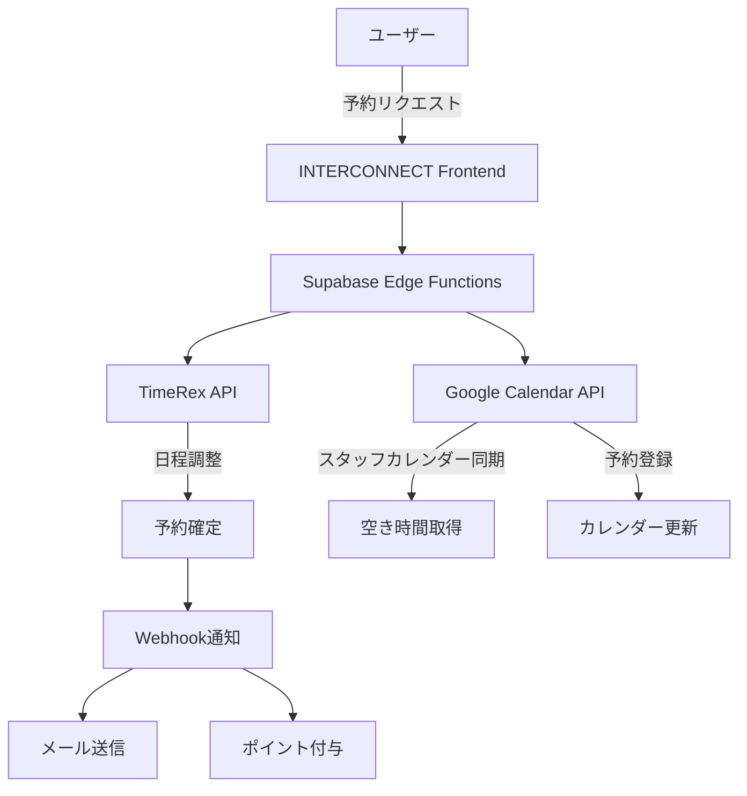

# TimeRex vs Google Calendar API 比較分析

## 結論：ハイブリッドアプローチを推奨

INTERCONNECTの要件を考慮すると、**TimeRexをメインの日程調整に使用し、Google Calendar APIを補助的に使用する**ハイブリッドアプローチが最適です。

## 詳細比較

### TimeRex API

#### メリット ✅
1. **日程調整に特化**
   - 複数人の空き時間を自動で算出
   - 日程候補の自動提案
   - 予約ページのカスタマイズが容易

2. **コスト面**
   - API利用は完全無料
   - フリープランでも基本機能は利用可能
   - 1連携まで無料（INTERCONNECTには十分）

3. **実装の簡易性**
   - OAuth認証だけで開始可能
   - Webhook対応（予約完了通知）
   - 日本語ドキュメント完備

4. **ユーザー体験**
   - 予約者はTimeRexアカウント不要
   - モバイル対応済み
   - 日本のビジネス慣習に対応

#### デメリット ❌
1. **機能制限**
   - フリープラン：API連携1つまで
   - カスタムフィールドは有料プラン
   - 高度な条件設定は有料プラン必要

2. **拡張性**
   - Google以外のカレンダーとの連携制限
   - カスタマイズの自由度が低い
   - 独自機能の追加が困難

### Google Calendar API

#### メリット ✅
1. **完全な制御**
   - 全機能を自由にカスタマイズ
   - 独自のビジネスロジック実装可能
   - 他のGoogle Workspaceとの統合

2. **拡張性**
   - 無制限のカスタマイズ
   - 複数カレンダーの統合管理
   - AIや機械学習との連携可能

3. **コスト**
   - 1日100万リクエストまで無料
   - INTERCONNECTの規模では無料枠で十分

#### デメリット ❌
1. **実装の複雑さ**
   - 日程調整ロジックを自前実装
   - タイムゾーン処理が複雑
   - 空き時間算出アルゴリズムが必要

2. **開発工数**
   - 実装に2-3倍の時間が必要
   - テストケースが膨大
   - エッジケースの処理が大変

## 推奨実装アーキテクチャ



## 実装フェーズ

### Phase 1: TimeRexで基本実装（2週間）
```typescript
// TimeRex OAuth設定
const timerex = new TimeRexClient({
  clientId: process.env.TIMEREX_CLIENT_ID,
  clientSecret: process.env.TIMEREX_CLIENT_SECRET,
  redirectUri: process.env.TIMEREX_REDIRECT_URI
});

// 予約ページ作成
const bookingPage = await timerex.createBookingPage({
  title: 'INTERCONNECT 面談予約',
  duration: 30,
  availableDays: [1, 2, 3, 4, 5],
  customFields: [
    { name: 'referralCode', type: 'hidden' },
    { name: 'consultationType', type: 'select' }
  ]
});
```

### Phase 2: Google Calendar連携（1週間）
```typescript
// スタッフのGoogleカレンダーと同期
const syncStaffCalendar = async (staffId: string) => {
  const events = await googleCalendar.events.list({
    calendarId: staffCalendar[staffId],
    timeMin: new Date().toISOString(),
    timeMax: addDays(new Date(), 30).toISOString()
  });
  
  // TimeRexの利用不可時間として登録
  await timerex.blockTimeSlots({
    staffId,
    blockedSlots: events.data.items.map(event => ({
      start: event.start.dateTime,
      end: event.end.dateTime
    }))
  });
};
```

### Phase 3: 紹介システム連携（1週間）
```typescript
// Webhook受信時の処理
app.post('/webhook/timerex', async (req, res) => {
  const { eventType, booking } = req.body;
  
  if (eventType === 'booking.completed') {
    // 紹介コードから紹介者を特定
    const referralCode = booking.customFields.referralCode;
    const referrer = await getReferrerByCode(referralCode);
    
    // Google Calendarにイベント作成
    await createGoogleCalendarEvent({
      summary: `面談: ${booking.userName}`,
      attendees: [booking.userEmail, booking.staffEmail],
      conferenceData: { createRequest: { requestId: booking.id } }
    });
    
    // ポイント付与の準備
    await recordBookingForReward(referrer.id, booking.id);
  }
});
```

## コスト試算

### TimeRex利用時
- 初期: 0円
- 月額: 0円（フリープラン）
- 将来的に必要になった場合: 750円/月（ベーシック）

### Google Calendar APIのみ
- 初期: 0円
- 月額: 0円
- 開発工数: +200時間（約100万円相当）

## 推奨理由

1. **即座に実装開始可能**
   - TimeRexで1週間以内にMVP完成
   - ユーザーテストを早期に開始

2. **段階的な拡張**
   - 基本機能はTimeRexで実現
   - 必要に応じてGoogle Calendar APIで拡張

3. **リスク軽減**
   - 複雑な日程調整ロジックの実装不要
   - バグやエッジケースはTimeRexが処理

4. **将来の柔軟性**
   - ユーザー数増加時は有料プランへ
   - 必要に応じて完全自前実装へ移行可能

## まとめ

INTERCONNECTの現在のフェーズでは、**TimeRexをメインに使用**することで：
- 開発期間を大幅短縮（3ヶ月→1ヶ月）
- 初期コストゼロ
- 安定した日程調整機能
- Google Calendarとの連携も可能

将来的にカスタマイズ要求が高まったら、Google Calendar APIへの完全移行を検討できます。