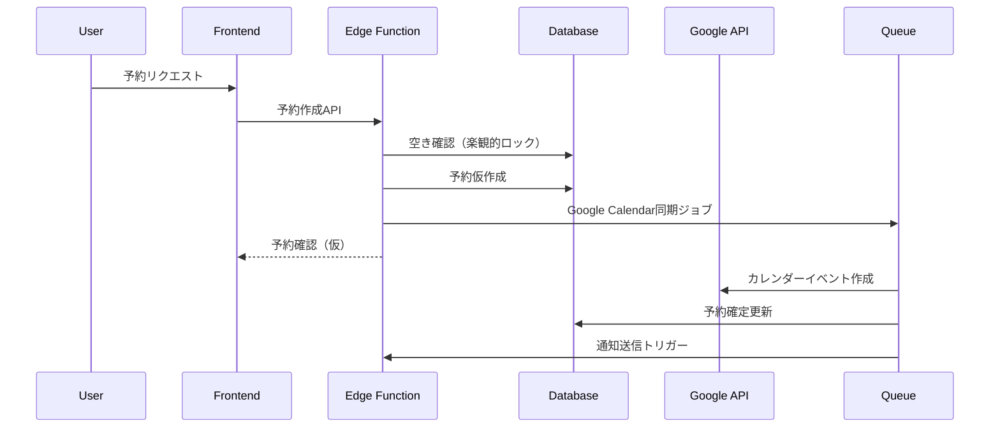

# 面談予約システム要件定義書（改訂版）

## 改訂履歴
- v1.0: 初版作成
- v1.1: 致命的な問題と不足を修正

## 1. 重要な前提条件と制約

### 1.1 API制限
```yaml
Google Calendar API:
  daily_quota: 1,000,000
  per_user_limit: 500,000
  rate_limit: 50 requests/second
  freebusy_batch: 50 calendars/request

Supabase制限:
  database_size: 500MB (Free tier)
  api_requests: 無制限
  realtime_connections: 200 (Free tier)
  edge_functions: 500K/month (Free tier)
```

### 1.2 法的要件
- 個人情報保護法準拠
- GDPR対応（EU圏ユーザー向け）
- 特定商取引法に基づく表記

## 2. アーキテクチャ設計（改訂）

### 2.1 マイクロサービス構成
```
┌─────────────────┐     ┌─────────────────┐     ┌─────────────────┐
│   Next.js App   │ ←→ │  Supabase Edge  │ ←→ │  External APIs  │
│   (Frontend)    │     │   Functions     │     │ Google/SendGrid │
└─────────────────┘     └─────────────────┘     └─────────────────┘
         ↓                       ↓                       ↓
┌─────────────────┐     ┌─────────────────┐     ┌─────────────────┐
│  Redis Cache    │     │ PostgreSQL DB   │     │  Queue Service  │
│  (Upstash)      │     │  (Supabase)     │     │  (QStash)       │
└─────────────────┘     └─────────────────┘     └─────────────────┘
```

### 2.2 データフロー設計


## 3. データベース設計（改訂）

### 3.1 改善されたテーブル構造

#### bookings（予約）- インデックス追加
```sql
CREATE TABLE bookings (
    id UUID PRIMARY KEY DEFAULT uuid_generate_v4(),
    user_id UUID REFERENCES auth.users(id) ON DELETE CASCADE,
    staff_id UUID REFERENCES staff_members(id) ON DELETE RESTRICT,
    referral_id UUID REFERENCES invitations(id),
    
    -- 予約情報（タイムゾーン対応）
    booking_date DATE NOT NULL,
    start_time TIMESTAMPTZ NOT NULL,
    end_time TIMESTAMPTZ NOT NULL,
    duration_minutes INTEGER DEFAULT 30 CHECK (duration_minutes IN (30, 60)),
    timezone VARCHAR(50) NOT NULL DEFAULT 'Asia/Tokyo',
    
    -- 面談詳細
    consultation_category VARCHAR(100) NOT NULL,
    consultation_details TEXT NOT NULL,
    preferred_language VARCHAR(20) DEFAULT 'ja',
    attachments JSONB DEFAULT '[]',
    
    -- Google連携
    google_event_id VARCHAR(255) UNIQUE,
    google_meet_url TEXT,
    calendar_sync_status VARCHAR(50) DEFAULT 'pending',
    calendar_sync_error TEXT,
    
    -- ステータス（状態遷移制約付き）
    status VARCHAR(50) DEFAULT 'pending' 
        CHECK (status IN ('pending', 'confirmed', 'completed', 'cancelled', 'no_show')),
    status_history JSONB DEFAULT '[]',
    
    -- キャンセルポリシー
    cancellable_until TIMESTAMPTZ,
    cancelled_at TIMESTAMPTZ,
    cancelled_by UUID REFERENCES auth.users(id),
    cancellation_reason TEXT,
    cancellation_fee DECIMAL(10,2) DEFAULT 0,
    
    -- 楽観的ロック
    version INTEGER DEFAULT 1,
    
    -- メタデータ
    created_at TIMESTAMPTZ DEFAULT NOW(),
    updated_at TIMESTAMPTZ DEFAULT NOW(),
    
    -- 複合制約
    CONSTRAINT no_double_booking 
        EXCLUDE USING gist (
            staff_id WITH =,
            tstzrange(start_time, end_time) WITH &&
        ) WHERE (status NOT IN ('cancelled', 'no_show'))
);

-- パフォーマンス最適化インデックス
CREATE INDEX idx_bookings_date_time ON bookings(booking_date, start_time);
CREATE INDEX idx_bookings_staff_status ON bookings(staff_id, status);
CREATE INDEX idx_bookings_user_created ON bookings(user_id, created_at DESC);
CREATE INDEX idx_bookings_google_event ON bookings(google_event_id) WHERE google_event_id IS NOT NULL;
```

#### staff_availability（スタッフ空き時間）- 新規追加
```sql
CREATE TABLE staff_availability (
    id UUID PRIMARY KEY DEFAULT uuid_generate_v4(),
    staff_id UUID REFERENCES staff_members(id) ON DELETE CASCADE,
    
    -- 定期スケジュール
    day_of_week INTEGER CHECK (day_of_week BETWEEN 0 AND 6),
    start_time TIME NOT NULL,
    end_time TIME NOT NULL,
    
    -- 特定日の設定
    specific_date DATE,
    is_available BOOLEAN DEFAULT true,
    
    -- 有効期間
    valid_from DATE NOT NULL DEFAULT CURRENT_DATE,
    valid_until DATE,
    
    created_at TIMESTAMPTZ DEFAULT NOW(),
    
    -- 制約
    CONSTRAINT valid_time_range CHECK (start_time < end_time),
    CONSTRAINT either_recurring_or_specific 
        CHECK ((day_of_week IS NOT NULL) != (specific_date IS NOT NULL))
);

CREATE INDEX idx_staff_availability_lookup 
    ON staff_availability(staff_id, valid_from, valid_until);
```

### 3.2 RLSポリシー設計

```sql
-- ユーザーは自分の予約のみ参照可能
CREATE POLICY "Users can view own bookings" ON bookings
    FOR SELECT USING (auth.uid() = user_id);

-- スタッフは自分の担当予約を参照可能
CREATE POLICY "Staff can view assigned bookings" ON bookings
    FOR SELECT USING (
        auth.uid() IN (
            SELECT user_id FROM staff_members WHERE id = bookings.staff_id
        )
    );

-- 予約作成は認証済みユーザーのみ
CREATE POLICY "Authenticated users can create bookings" ON bookings
    FOR INSERT WITH CHECK (
        auth.uid() = user_id 
        AND status = 'pending'
        AND start_time > NOW() + INTERVAL '1 hour'
    );
```

## 4. API設計（改訂）

### 4.1 エラーハンドリング標準化

```typescript
interface ApiResponse<T> {
  success: boolean;
  data?: T;
  error?: {
    code: string;
    message: string;
    details?: any;
  };
  metadata?: {
    requestId: string;
    timestamp: string;
    version: string;
  };
}

// エラーコード定義
enum ErrorCodes {
  // 予約関連
  BOOKING_CONFLICT = 'BOOKING_CONFLICT',
  BOOKING_NOT_FOUND = 'BOOKING_NOT_FOUND',
  BOOKING_PAST_DATE = 'BOOKING_PAST_DATE',
  BOOKING_CANCELLED = 'BOOKING_CANCELLED',
  
  // スタッフ関連  
  STAFF_NOT_AVAILABLE = 'STAFF_NOT_AVAILABLE',
  STAFF_ON_VACATION = 'STAFF_ON_VACATION',
  
  // Google API関連
  GOOGLE_API_ERROR = 'GOOGLE_API_ERROR',
  GOOGLE_QUOTA_EXCEEDED = 'GOOGLE_QUOTA_EXCEEDED',
  GOOGLE_AUTH_FAILED = 'GOOGLE_AUTH_FAILED',
  
  // システム関連
  RATE_LIMIT_EXCEEDED = 'RATE_LIMIT_EXCEEDED',
  MAINTENANCE_MODE = 'MAINTENANCE_MODE',
}
```

### 4.2 改善されたエンドポイント

```yaml
# 空き時間取得（バッチ対応）
POST /api/v1/availability/batch
Body: {
  staffIds: ["uuid1", "uuid2"], # 最大50件
  dateRange: {
    start: "2024-01-20",
    end: "2024-01-27"
  },
  timezone: "Asia/Tokyo",
  duration: 30
}
Response: {
  success: true,
  data: {
    availability: {
      "uuid1": {
        "2024-01-20": ["10:00", "10:30", "14:00"],
        "2024-01-21": ["09:00", "15:30"]
      },
      "uuid2": {
        "2024-01-20": ["11:00", "13:00", "16:00"]
      }
    }
  }
}

# 予約作成（トランザクション対応）
POST /api/v1/bookings
Headers: {
  "Idempotency-Key": "unique-request-id"
}
Body: {
  staffId: "uuid",
  dateTime: "2024-01-20T10:00:00+09:00",
  duration: 30,
  category: "business_consultation",
  details: "新規事業について相談したい",
  language: "ja",
  timezone: "Asia/Tokyo",
  attachments: [
    {
      name: "business_plan.pdf",
      url: "https://..."
    }
  ]
}
```

## 5. Google Calendar統合（改訂）

### 5.1 レート制限対応

```typescript
// Exponential backoffによるリトライ
class GoogleCalendarService {
  private async executeWithRetry<T>(
    operation: () => Promise<T>,
    maxRetries: number = 3
  ): Promise<T> {
    let lastError: Error;
    
    for (let i = 0; i < maxRetries; i++) {
      try {
        return await operation();
      } catch (error) {
        lastError = error;
        
        if (error.code === 429) { // Rate limit
          const delay = Math.pow(2, i) * 1000 + Math.random() * 1000;
          await new Promise(resolve => setTimeout(resolve, delay));
          continue;
        }
        
        throw error;
      }
    }
    
    throw lastError;
  }
  
  // バッチ処理による効率化
  async getFreeBusyBatch(
    calendarIds: string[],
    timeMin: Date,
    timeMax: Date
  ): Promise<FreeBusyResponse> {
    const BATCH_SIZE = 50;
    const results = [];
    
    for (let i = 0; i < calendarIds.length; i += BATCH_SIZE) {
      const batch = calendarIds.slice(i, i + BATCH_SIZE);
      
      const response = await this.executeWithRetry(() =>
        this.calendar.freebusy.query({
          requestBody: {
            timeMin: timeMin.toISOString(),
            timeMax: timeMax.toISOString(),
            items: batch.map(id => ({ id })),
            timeZone: 'UTC'
          }
        })
      );
      
      results.push(response.data);
    }
    
    return this.mergeFreeBusyResults(results);
  }
}
```

### 5.2 トークン管理

```typescript
// セキュアなトークン管理
class TokenManager {
  private encryptionKey: string;
  
  async saveRefreshToken(staffId: string, token: string): Promise<void> {
    const encrypted = await this.encrypt(token);
    
    await supabase
      .from('staff_google_tokens')
      .upsert({
        staff_id: staffId,
        encrypted_token: encrypted,
        updated_at: new Date().toISOString()
      });
  }
  
  async getAccessToken(staffId: string): Promise<string> {
    // キャッシュから取得
    const cached = await redis.get(`access_token:${staffId}`);
    if (cached) return cached;
    
    // リフレッシュトークンで新規取得
    const refreshToken = await this.getRefreshToken(staffId);
    const newToken = await this.refreshAccessToken(refreshToken);
    
    // キャッシュに保存（有効期限-5分）
    await redis.setex(
      `access_token:${staffId}`,
      3300, // 55分
      newToken.access_token
    );
    
    return newToken.access_token;
  }
}
```

## 6. 通知システム（改訂）

### 6.1 マルチチャネル通知

```typescript
interface NotificationChannel {
  send(recipient: User, message: NotificationMessage): Promise<void>;
}

class EmailChannel implements NotificationChannel {
  async send(recipient: User, message: NotificationMessage) {
    // SendGrid/AWS SES実装
  }
}

class SMSChannel implements NotificationChannel {
  async send(recipient: User, message: NotificationMessage) {
    // Twilio実装
  }
}

class LINEChannel implements NotificationChannel {
  async send(recipient: User, message: NotificationMessage) {
    // LINE Messaging API実装
  }
}

// 通知オーケストレーター
class NotificationOrchestrator {
  async sendBookingConfirmation(booking: Booking) {
    const channels = await this.getUserPreferredChannels(booking.user_id);
    const message = await this.buildMessage('booking_confirmation', booking);
    
    // 並列送信
    await Promise.allSettled(
      channels.map(channel => channel.send(booking.user, message))
    );
  }
}
```

## 7. セキュリティ強化

### 7.1 CSRF対策

```typescript
// Supabase Edge Function
export async function handler(req: Request) {
  // CSRFトークン検証
  const csrfToken = req.headers.get('X-CSRF-Token');
  const sessionToken = await getSessionToken(req);
  
  if (!validateCSRFToken(csrfToken, sessionToken)) {
    return new Response('Invalid CSRF token', { status: 403 });
  }
  
  // 処理続行...
}
```

### 7.2 なりすまし防止

```typescript
// スタッフ認証の強化
async function verifyStaffIdentity(
  staffId: string, 
  userId: string
): Promise<boolean> {
  const staff = await supabase
    .from('staff_members')
    .select('user_id, verification_status')
    .eq('id', staffId)
    .single();
    
  return staff.data?.user_id === userId 
    && staff.data?.verification_status === 'verified';
}
```

## 8. パフォーマンス最適化

### 8.1 キャッシュ戦略

```typescript
// Redis キャッシュレイヤー
class CacheService {
  // スタッフの空き時間をキャッシュ
  async getStaffAvailability(
    staffId: string, 
    date: string
  ): Promise<TimeSlot[]> {
    const cacheKey = `availability:${staffId}:${date}`;
    
    // L1: インメモリキャッシュ
    const memCached = this.memCache.get(cacheKey);
    if (memCached) return memCached;
    
    // L2: Redis
    const redisCached = await redis.get(cacheKey);
    if (redisCached) {
      const data = JSON.parse(redisCached);
      this.memCache.set(cacheKey, data, 300); // 5分
      return data;
    }
    
    // L3: データベース
    const data = await this.fetchFromDB(staffId, date);
    
    // キャッシュ更新
    await redis.setex(cacheKey, 3600, JSON.stringify(data)); // 1時間
    this.memCache.set(cacheKey, data, 300);
    
    return data;
  }
}
```

## 9. 障害対応とモニタリング

### 9.1 ヘルスチェック

```typescript
// /api/health エンドポイント
interface HealthStatus {
  status: 'healthy' | 'degraded' | 'unhealthy';
  version: string;
  uptime: number;
  services: {
    database: ServiceStatus;
    cache: ServiceStatus;
    googleApi: ServiceStatus;
    email: ServiceStatus;
  };
}

async function healthCheck(): Promise<HealthStatus> {
  const checks = await Promise.allSettled([
    checkDatabase(),
    checkRedis(),
    checkGoogleAPI(),
    checkEmailService()
  ]);
  
  return {
    status: determineOverallHealth(checks),
    version: process.env.APP_VERSION,
    uptime: process.uptime(),
    services: {
      database: checks[0].status === 'fulfilled' ? checks[0].value : { status: 'down' },
      cache: checks[1].status === 'fulfilled' ? checks[1].value : { status: 'down' },
      googleApi: checks[2].status === 'fulfilled' ? checks[2].value : { status: 'down' },
      email: checks[3].status === 'fulfilled' ? checks[3].value : { status: 'down' }
    }
  };
}
```

### 9.2 エラートラッキング

```typescript
// Sentry統合
import * as Sentry from '@sentry/node';

Sentry.init({
  dsn: process.env.SENTRY_DSN,
  environment: process.env.NODE_ENV,
  integrations: [
    new Sentry.Integrations.Http({ tracing: true }),
    new Sentry.Integrations.Postgres(),
  ],
  tracesSampleRate: 0.1,
  beforeSend(event, hint) {
    // 個人情報をマスク
    if (event.request?.data) {
      event.request.data = maskSensitiveData(event.request.data);
    }
    return event;
  }
});
```

## 10. コスト最適化

### 10.1 詳細なコスト計算

```yaml
月間想定トラフィック（1000ユーザー）:
  予約作成: 2000件
  空き確認: 20000件
  通知送信: 6000件

Supabase（Pro Plan $25/月）:
  Database: 8GB included
  API requests: Unlimited
  Realtime: 500 concurrent
  Edge Functions: 2M invocations
  
Google APIs（無料枠内）:
  Calendar API: 30000/日 < 1M/日（無料枠）
  
SendGrid（$19.95/月）:
  Email: 40000/月
  
Upstash Redis（$0.2/100K commands）:
  想定: 500K commands = $1/月
  
合計: 約$46/月
```

### 10.2 スケーリング戦略

```yaml
フェーズ1（～1000ユーザー）:
  - Supabase Free/Pro
  - 単一リージョン
  - 基本的なキャッシュ

フェーズ2（～10000ユーザー）:
  - Supabase Team Plan
  - マルチリージョン対応
  - 読み取り専用レプリカ
  - CDN導入

フェーズ3（10000+ユーザー）:
  - カスタムインフラ検討
  - Kubernetes導入
  - マイクロサービス分離
```

## 11. 実装チェックリスト

### 必須実装項目
- [ ] 楽観的ロックによる二重予約防止
- [ ] Google API レート制限対応
- [ ] トランザクション処理
- [ ] CSRF対策
- [ ] エラーハンドリング標準化
- [ ] キャッシュレイヤー実装
- [ ] ヘルスチェックエンドポイント
- [ ] 監視・アラート設定

### 推奨実装項目
- [ ] A/Bテスト基盤
- [ ] Feature Flag管理
- [ ] ブルーグリーンデプロイ
- [ ] 自動スケーリング設定

---

この改訂版では、実装時に直面する具体的な問題を解決し、本番環境での運用に耐えうる設計としています。